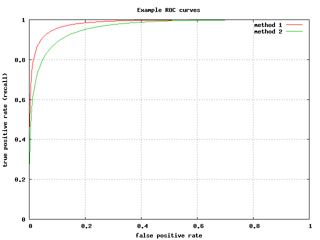
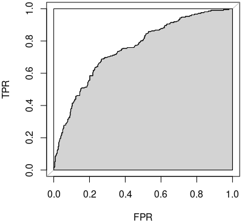

---
title: Data Science Fundamentals
published: 2026-02-01
description: "Core data science evaluation, validation, and feature practices."
tags: ["Data Science Fundamentals"]
category: IOAI ML Notes
draft: false
---

# Syllabus Map

* Study map: [Syllabus Study Map](/posts/syllabus/ioai-study-map/)

---

# Overview

* **Data science fundamentals** cover evaluation, validation, and feature workflows.
* Emphasis is on **reliable model assessment** and **clean data pipelines**.
* Good practice separates **data understanding**, **modelling**, and **monitoring** into repeatable steps.
* Most pitfalls come from **leakage**, **bias in data collection**, or **misaligned metrics**.

---

# Evaluation Metrics

## Classification Metrics

### Accuracy
* Formula: $ \frac{TP + TN}{TP + TN + FP + FN} $.
* Best when classes are **balanced**.
* Can be misleading under **class imbalance**.

### Precision
* Formula: $ \frac{TP}{TP + FP} $.
* Answers: **How many predicted positives are correct?**
* Prioritise when **false positives** are costly.

### Recall
* Formula: $ \frac{TP}{TP + FN} $.
* Answers: **How many actual positives are found?**
* Prioritise when **false negatives** are costly.

### F1-score
* Formula: $ 2 \cdot \frac{\text{Precision} \cdot \text{Recall}}{\text{Precision} + \text{Recall}} $.
* Balances **precision** and **recall**.
* Useful when you need a single score under **imbalance**.

### Balanced Accuracy
* Formula: $ \frac{1}{2}(\text{TPR} + \text{TNR}) $.
* Accounts for **unequal class sizes**.
* Equivalent to the average of per-class recall in binary settings.

### Macro vs Micro Averaging
* **Macro**: average metric per class (treats all classes equally).
* **Micro**: aggregate counts across classes (weights by class frequency).
* Use macro when minority classes matter; micro for overall performance.

## Diagnostic Tools

* **Confusion matrix**: shows per-class error structure.
* **ROC curve** and **AUC**: threshold-independent tradeoff of TPR vs FPR.
* **PR curve** is often more informative under heavy class imbalance.
* **Calibration**: reliability curves and Brier score measure probability quality.

### Confusion Matrix

* Summarizes **true positives**, **false positives**, **true negatives**, and **false negatives**.
* Makes **error types** visible (e.g., false alarms vs misses).
* Helps identify **systematic confusion** between specific classes.

### ROC Curve

* Plots **True Positive Rate (TPR)** vs **False Positive Rate (FPR)** across thresholds.
* Shows the **tradeoff** between sensitivity and false alarms.
* Curves closer to the top-left indicate **better separability**.

### AUC

* AUC measures the **area under the ROC curve** (higher is better).
* Interpretable as the **probability a random positive ranks above a random negative**.
* Useful for **threshold-free** comparison of classifiers.

### PR Curve

* Plots **Precision** vs **Recall** across thresholds.
* More informative than ROC under **class imbalance**.
* Focuses on **positive-class performance**.

## Regression Metrics

### MSE
* Formula: $ \frac{1}{n}\sum_{i=1}^n (y_i - \hat{y}_i)^2 $.
* Penalises **large errors** heavily.
* Differentiable and common for optimisation.

### MAE
* Formula: $ \frac{1}{n}\sum_{i=1}^n |y_i - \hat{y}_i| $.
* More **robust to outliers** than MSE.
* Interpretable in the same units as the target.

### $R^2$
* Formula: $ 1 - \frac{\sum (y_i - \hat{y}_i)^2}{\sum (y_i - \bar{y})^2} $.
* Measures **variance explained** by the model.
* Can be negative if the model is worse than predicting the mean.

### MAPE
* Formula: $ \frac{100}{n}\sum \left|\frac{y_i-\hat{y}_i}{y_i}\right| $.
* Expresses error as a **percentage**.
* Avoid when $ y_i \approx 0 $ (can blow up).

---

# Bias, Variance, and Generalisation

* Refer to bias-variance notes for more detail
* **Bias**: error from overly simple assumptions.
* **Variance**: error from sensitivity to data fluctuations.
* Goal is to minimize **expected generalisation error**: $ \mathbb{E}_{(x,y)}[\ell(y, f(x))] $.

## Underfitting

* Model is **too simple** to capture signal.
* High training error and high validation error.
* Fix by adding features, increasing model capacity, or reducing regularisation.

## Overfitting

* Model **memorizes noise** and fails to generalize.
* Low training error, high validation error.
* Fix with regularisation, more data, or simpler models.

---

# Validation Strategy

## Train / Validation / Test Split

* Use **separate splits** to avoid leakage.
* Keep the **test set frozen** until final evaluation.
* For time series, use **temporal splits** instead of random shuffles.

## Cross-Validation

* Estimate **generalisation** more robustly.
* **K-fold CV** balances bias/variance in the estimate.
* **Stratified CV** preserves label distribution.
* Use **nested CV** when tuning hyperparameters.

---

# Feature Engineering

## Encoding

### One-hot encoding
* Expands a category into a **binary vector**.
* Works well for low-cardinality, **unordered** categories.
* Can blow up dimensionality for high-cardinality fields.

### Target / frequency encoding
* Replaces categories with **label statistics** or counts.
* Useful for **high-cardinality** features.
* Must be computed with **leakage-safe folds**.

### Ordinal encoding
* Assigns integer levels to **ordered** categories.
* Preserves rank information (e.g., small < medium < large).
* Can mislead models if the order is **arbitrary**.

## Statistical Features

### Summary statistics
* Use **mean**, **variance**, **percentiles** over groups or windows.
* Captures distributional shape in a compact form.
* Helpful for user/item aggregation features.

### Rolling windows
* Aggregate over a **moving time window**.
* Useful for trends (e.g., last 7 days vs last 30 days).
* Requires careful handling of **time leakage**.

### Lag features
* Include past values: $ x_{t-1}, x_{t-2}, \dots $.
* Captures **autoregressive** structure.
* Choose lag depth based on domain and sampling rate.

### Seasonality indicators
* Encode cyclical patterns (hour/day/week/month).
* Often combined with **sine/cosine** transforms.
* Helps models separate trend from periodicity.

## Embeddings

### Learned embeddings
* Dense vectors learned jointly with the model.
* Compactly encode **semantic similarity**.
* Common in NLP and recommender systems.

### Pretrained embeddings
* Reduce data needs with **transfer learning**.
* Provide strong baselines for text and vision tasks.
* Fine-tuning aligns embeddings with your target labels.

---

# Data Processing

## Missing Values

* **Impute** with mean/median or model-based methods.
* Add **missingness indicators** if absence is informative.
* Validate imputation on training folds only.

## Scaling

* **Standardization** or **normalisation**.
* For models using distance (k-NN, SVM), scaling is essential.
* Fit scalers on training data only to avoid leakage.

## Data Augmentation

* **Flip**, **crop**, **noise injection**.
* Use augmentation to improve robustness, not to replace real data.
* For NLP, consider back-translation or synonym replacement.

