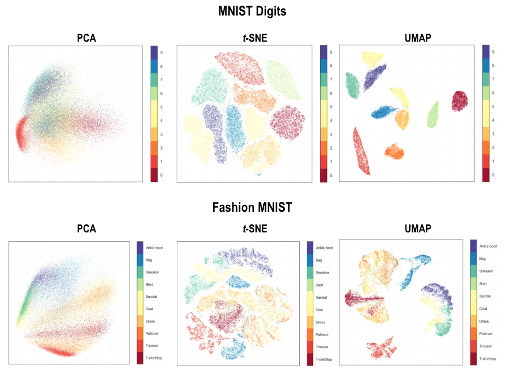

# Syllabus Map

* Study map: [Syllabus Study Map](/posts/syllabus/ioai-study-map/)

---
# Overview

* **t-SNE and UMAP** are **nonlinear techniques** for visualising high-dimensional data.
* Both focus on preserving **local structure** in low-dimensional projections.

---

# t-SNE (T-distributed Stochastic Neighbour Embedding)

## Core Idea

* t-SNE builds a **2D/3D map** that keeps **nearby points** in the original space **nearby in the embedding**.
* It prioritises **local neighborhoods** over global geometry.

## How It Works (Step-by-Step)

### Step 1: Compute High-Dimensional Similarities

* For each point $x_i$, convert distances to conditional probabilities:
  $$
  p_{j|i} = \frac{\exp\left(-\|x_i - x_j\|^2 / 2\sigma_i^2\right)}{\sum_{k \ne i} \exp\left(-\|x_i - x_k\|^2 / 2\sigma_i^2\right)}
  $$
* The bandwidth $\sigma_i$ is chosen so that the **perplexity** of $p_{j|i}$ matches a target value.
* Perplexity is a parameter that sets the **effective number of neighbours** each point should have in t‑SNE.
* This represents **how likely point $(x_i)$ would “choose” point $(x_j)$ as a neighbour** if neighbours were sampled from a **Gaussian centred at $(x_i)$**.

### Step 2: Symmetrise the Probabilities

* Convert conditionals to joint probabilities:
  $$
  p_{ij} = \frac{p_{j|i} + p_{i|j}}{2n}
  $$
* This yields a symmetric similarity matrix that sums to 1.
* $p_{ij}$ represents **mutual similarity**, which is how strongly $x_i$ and $x_j$ are neighbours of each other in the original space.

### Step 3: Define Low-Dimensional Similarities

* Place points $y_i$ in 2D/3D and define:
  $$
  q_{ij} = \frac{\left(1 + \|y_i - y_j\|^2\right)^{-1}}{\sum_{k \ne l} \left(1 + \|y_k - y_l\|^2\right)^{-1}}
  $$
* The **Student‑t distribution** (heavy‑tailed) prevents crowding in low dimensions.
* $q_{ij}$ is a **score for how close two points look in the 2D/3D map** for all data points, turned into a probability.

### Step 4: Optimise the Embedding

* Minimise KL divergence between the two distributions:
  $$
  \text{KL}(P\|Q) = \sum_{i \ne j} p_{ij} \log \frac{p_{ij}}{q_{ij}}
  $$
* **KL divergence** (Kullback–Leibler divergence) measures **how different** one probability distribution is from another. 
* It is neither symmetric nor a true distance.
* It tells you **how much “information” is lost** when you **approximate one distribution with another**.
* Use gradient descent (often with momentum) to update $y_i$.

## Practical Notes

### Hyperparameter Sensitivity

* Sensitive to **perplexity** and **learning rate**.

### Primary Use Case

* Typically used for **visualisation**, not downstream modelling.

## Limitations

* In t-SNE plots, the **distance between separate clusters is usually not meaningful**.
* You can interpret **which points are local neighbours**, but not absolute spacing or relative gaps between far-apart groups.
* t-SNE can show **splintering**, where one true cluster is broken into multiple small islands due to: 
  * Hyperparameter choices
  * Noise
  * Optimisation randomness
* Because of splintering, visual clusters in 2D should be validated against the original high-dimensional structure before making conclusions.

---

# UMAP (Uniform Manifold Approximation and Projection)

## Core Idea

* UMAP builds a **high‑dimensional neighbour graph**, then builds a **low‑dimensional graph** from the embedding.
* It **trains the embedding** so the low‑dimensional graph **matches** the high‑dimensional graph.
* This balances **local structure** with some **global geometry**.

## How It Works (Step-by-Step)

### Step 1: Build the k-NN Graph

* For each point $x_i$, find its $k$ nearest neighbours under the chosen metric.
* This defines a weighted graph over the data.

### Step 2: Compute Fuzzy Membership Strengths

* Convert distances into edge probabilities:
  $$
  w_{ij} = \exp\left(-\frac{\max(0, d(x_i, x_j) - \rho_i)}{\sigma_i}\right)
  $$
* $\rho_i$ ensures each point has a zero-distance neighbour; $\sigma_i$ controls local connectivity.
* “Fuzzy” means neighbours are not binary; instead each edge has a membership strength between 0 and 1.

### Step 3: Construct the Low-Dimensional Fuzzy Graph

* Initialise low‑dimensional points $y_i$.
* Common initialisation choices:
  * **Spectral** (common default): uses a spectral layout from the graph structure.
  * **Random**: starts points from random positions.
  * **PCA**: starts from a PCA projection.
  * **Custom init**: uses user-provided initial coordinates.
* For low-dimensional points $y_i$, define:
  $$
  \tilde{w}_{ij} = \frac{1}{1 + a\|y_i - y_j\|^{2b}}
  $$
* Parameters $a, b$ are chosen based on `min_dist` and the desired embedding smoothness.

### Step 4: Optimise by Matching Graphs

* Minimise cross‑entropy between $w_{ij}$ and $\tilde{w}_{ij}$:
  $$
  L = \sum_{i \ne j} \left[w_{ij}\log \tilde{w}_{ij} + (1 - w_{ij})\log(1 - \tilde{w}_{ij})\right]
  $$
* Use stochastic gradient descent with negative sampling for efficiency.

## Intuition

* Think of UMAP as turning data into a **network of nearby points**, then finding a 2D/3D layout that keeps neighbours close.
* Points that are **strongly connected** stay close; weakly connected points can drift apart.

## Key Hyperparameters

* `n_neighbors`: controls **local vs. global** structure (smaller = more local).
* `min_dist`: controls **how tightly points pack** in the embedding (smaller = tighter clusters).
* `metric`: defines **distance** in the original space (e.g., `euclidean`, `cosine`).

## Practical Notes

### Runtime on Large Datasets

* **Faster than t-SNE** for larger datasets.

### Global Structure Preservation

* Often preserves **more global structure** than t-SNE.

### Supervised and Semi-Supervised UMAP

* UMAP can be run in a **supervised or semi-supervised** mode, where target labels are used to influence the neighbour graph and pull same-label points closer in the embedding.
* This often improves class separation for visualisation, but can hide true unsupervised structure if labels are noisy or incomplete.

### Fit/Transform Workflow

* Fit on training data only; **transform** validation/test consistently.

### Axis Interpretability

* Embeddings are **nonlinear** and **not directly interpretable** as feature axes.

---

# PCA vs t-SNE vs UMAP

## Quick Comparison

| Method | Type | What It Preserves Best | Speed | Typical Use |
|---|---|---|---|---|
| PCA | Linear projection | Global variance structure | Fastest | Compression, preprocessing, baseline visualisation |
| t-SNE | Nonlinear embedding | Local neighbourhoods | Slowest | Visual cluster inspection |
| UMAP | Nonlinear manifold/graph embedding | Local structure + some global geometry | Medium | Visualisation and sometimes downstream features |

## Key Takeaways

* **PCA** is best when you want a simple, stable linear reduction.
* **t-SNE** is best for local cluster visualisation, but inter-cluster distances are not reliable.
* **UMAP** often gives a better speed/structure tradeoff and supports supervised guidance.
