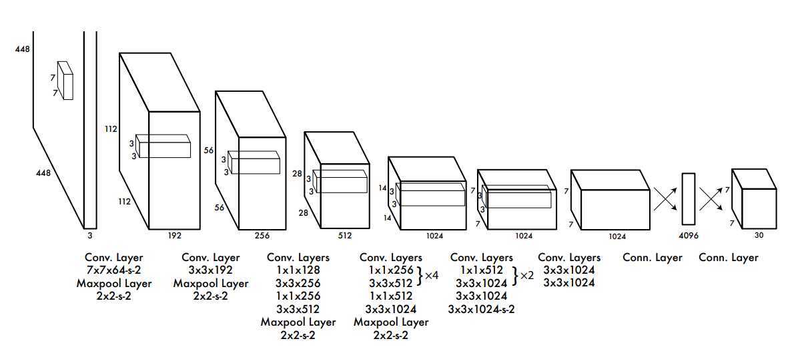

# Syllabus Map

* Study map: [Syllabus Study Map](/posts/syllabus/ioai-study-map/)

---
# Overview

* CNNs are used for image-level prediction, region-level localization, and pixel-level labeling.
* The output granularity determines the task:
* **Image classification**: one label per image.
* **Object detection**: boxes + labels per object.
* **Image segmentation**: label per pixel.

---

# Image Classification

## Core Idea

* Input: full image tensor $H \times W \times C$.
* Output: class probability vector of size $K$.
* Train with cross-entropy on labeled images.
* Evaluate with top-1/top-5 accuracy and confusion matrix.

---

# Object Detection

## Core Idea

* Input: image with variable number of objects.
* Output: $(x, y, w, h, \text{class}, \text{confidence})$ per detected object.
* Train with multi-part loss: classification + box regression (+ objectness).
* Evaluate with mAP at different IoU thresholds (for example, mAP@0.5 and mAP@[0.5:0.95]).

## You-Only-Look-Once (YOLO)

### Step 1: Prepare Labels

* Convert annotations to normalized box format $(c_x, c_y, w, h, \text{class\_id})$.
* Ensure class IDs are contiguous and images/labels are paired correctly.

### Step 2: Train Grid-Based Predictions

* Split image into feature grid cells.
* Predict objectness, class scores, and box offsets per anchor/location.

### Step 3: Optimize Detection Loss

* Compute objectness loss for object/background.
* Compute class loss for positive samples.
* Compute box loss (IoU-based or L1-style, depending on YOLO version).
* A common multi-part objective is:

$$
\mathcal{L}_{\text{YOLO}}=
\lambda_{\text{box}}\mathcal{L}_{\text{box}}+
\lambda_{\text{obj}}\mathcal{L}_{\text{obj}}+
\lambda_{\text{cls}}\mathcal{L}_{\text{cls}}
$$
* Where: box/objectness/class losses are weighted by $\lambda_{\text{box}}, \lambda_{\text{obj}}, \lambda_{\text{cls}}$.

$$
\mathcal{L}_{\text{box}}=\sum_{i\in \text{Pos}}\left(1-\text{IoU}(b_i,\hat{b}_i)\right)
$$
* Where: $\text{Pos}$ are matched positive anchors; higher IoU gives lower box loss.

$$
\mathcal{L}_{\text{obj}}=-\sum_i \left[y_i\log p_i+(1-y_i)\log(1-p_i)\right]
$$
* Binary cross-entropy over object/background labels ($y_i$) and objectness predictions ($p_i$).

$$
\mathcal{L}_{\text{cls}}=-\sum_{i\in \text{Pos}}\sum_{c=1}^{C} y_{i,c}\log \hat{p}_{i,c}
$$
* Cross-entropy on class predictions for positive anchors only.

### Step 4: Run Post-Processing

* Filter low-confidence predictions.
* Compute overlap with Intersection over Union (IoU):

$$
\text{IoU}(A,B)=\frac{|A\cap B|}{|A\cup B|}
$$
* IoU ranges from 0 (no overlap) to 1 (perfect overlap).
* Apply Non-Maximum Suppression (NMS) to remove duplicate detections:
  * Sort boxes by confidence score.
  * Keep the highest-score box and suppress lower-score boxes that overlap it too much.
  * Repeat until no candidate boxes remain.

$$
\text{suppress } b_j \text{ if } \text{IoU}(b_i,b_j)>\tau_{\text{nms}} \text{ and } s_i>s_j
$$
* Keep higher-score box $b_i$ and suppress overlapping lower-score boxes above threshold $\tau_{\text{nms}}$.

### Step 5: Evaluate and Deploy

* Measure mAP and latency.
* Tune confidence/NMS thresholds for task-specific precision-recall tradeoff.

---

## Single Shot MultiBox Detector (SSD)

### Step 1: Build Multi-Scale Feature Maps

* Extract backbone features at several spatial resolutions.
* Attach detection heads to each scale for small-to-large objects.

### Step 2: Match Ground Truth to Default Boxes

* Predefine default boxes (anchors) with multiple scales/aspect ratios.
* Match anchors to ground-truth boxes using IoU rules.

### Step 3: Train Classification and Localization

* Predict class logits for each anchor.
* Predict box offsets relative to matched default boxes.
* Typical SSD objective:

$$
\mathcal{L}_{\text{SSD}}=\frac{1}{N}\left(\mathcal{L}_{\text{cls}}+\alpha \mathcal{L}_{\text{loc}}\right)
$$
* Where: $N$ is number of matched positives, and $\alpha$ balances localization vs classification.

$$
\mathcal{L}_{\text{loc}}=\sum_{i\in \text{Pos}} \space \sum_{m\in\{c_x,c_y,w,h\}}
\text{SmoothL1}\!\left(t_i^m-\hat{t}_i^m\right)
$$
* SmoothL1 regression over box center/size offsets for positive anchors.

### Step 4: Apply Hard Negative Mining

* Keep informative negative anchors with highest classification loss.
* Balance positive and negative samples during training.
* Standard ratio target is:

$$
\frac{N_{\text{neg}}}{N_{\text{pos}}}\le 3
$$
* At most 3 negatives per positive anchor during hard negative mining.

### Step 5: Decode and Filter Predictions

* Convert offsets back to absolute boxes.
* Apply confidence thresholding and NMS before final outputs.

---

## Detection Transformers (DETR)

### Step 1: Encode Image Features

* Run image through a CNN backbone to get feature maps.
* Flatten features and add positional encodings.

### Step 2: Decode with Object Queries

* Feed learned object queries into a transformer decoder.
* Each query predicts one potential object slot.

### Step 3: Hungarian Matching

* Match predictions to ground-truth objects one-to-one.
* Use matching cost from class and box terms.
* Matching is solved by:

$$
\hat{\sigma}=\arg\min_{\sigma}\sum_i
\left[
-\log \hat{p}_{\sigma(i)}(c_i)+
\lambda_1\|b_i-\hat{b}_{\sigma(i)}\|_1+
\lambda_2\left(1-\text{GIoU}(b_i,\hat{b}_{\sigma(i)})\right)
\right]
$$
* Matching cost combines class confidence, L1 box distance, and GIoU overlap.

### Step 4: Optimize Set Prediction Loss

* Train class predictions including a "no-object" class.
* Train box regression with L1 + generalized IoU loss.
* DETR set loss:

$$
\mathcal{L}_{\text{DETR}}=
\mathcal{L}_{\text{cls}}+
\lambda_1\mathcal{L}_{L1}+
\lambda_2\mathcal{L}_{\text{GIoU}}
$$
* Set prediction loss = class loss (with no-object) + weighted L1/GIoU box losses.

### Step 5: Inference without NMS

* Keep high-confidence query outputs directly.
* One-to-one matching behavior reduces duplicate detections.

---

# Image Segmentation

## Core Idea

* Input: image and dense pixel mask labels.
* Output: mask $H \times W$ (semantic) or per-instance masks (instance segmentation).
* Train with pixel-wise losses (cross-entropy, Dice, or combined loss).
* Evaluate with IoU (Jaccard), Dice score, and pixel accuracy.

## Semantic vs Instance Segmentation

### Semantic Segmentation

* Assigns a class label to every pixel.
* Pixels from different objects of the same class share one label region.
* Example: all person pixels are labeled "person" without separating person A vs person B.

### Instance Segmentation

* Assigns both class and instance identity to pixels.
* Different objects of the same class get separate masks.
* Example: each person in the scene gets its own mask (person 1, person 2, ...).

## U-Net

### Step 1: Encode Context

* Downsample with convolution blocks to capture global context.
* Store intermediate feature maps for skip connections.

### Step 2: Decode Spatial Detail

* Upsample progressively back to image resolution.
* Concatenate decoder features with matching encoder skip features.

### Step 3: Predict Pixel Masks

* Use final convolution layer to output per-pixel class logits.
* Convert logits to masks with softmax/sigmoid.

### Step 4: Train with Dense Losses

* Use cross-entropy for multi-class segmentation.
* Add Dice loss when classes are imbalanced or objects are thin/small.
* Common combined objective:

$$
\mathcal{L}_{\text{seg}}=
\lambda_{\text{ce}}\mathcal{L}_{\text{CE}}+
\lambda_{\text{dice}}\mathcal{L}_{\text{Dice}}
$$
* Combined segmentation loss: pixel-wise CE + weighted Dice overlap loss.

$$
\mathcal{L}_{\text{Dice}}=
1-\frac{2\sum_i p_i y_i+\epsilon}{\sum_i p_i+\sum_i y_i+\epsilon}
$$
* $p_i$ and $y_i$ are predicted and ground-truth mask values; $\epsilon$ stabilizes division.

### Step 5: Post-Process Masks

* Apply thresholding for binary masks.
* Use connected components or morphology to clean noisy regions.
