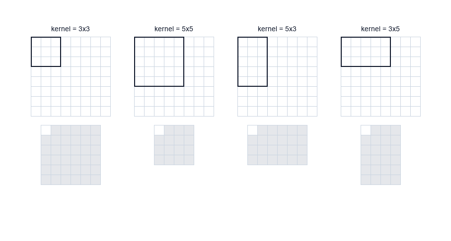
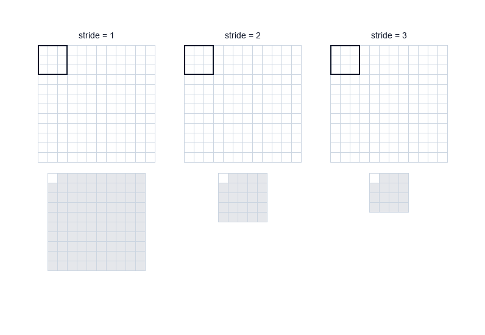
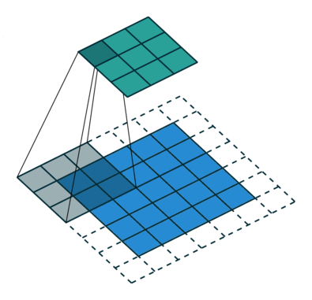
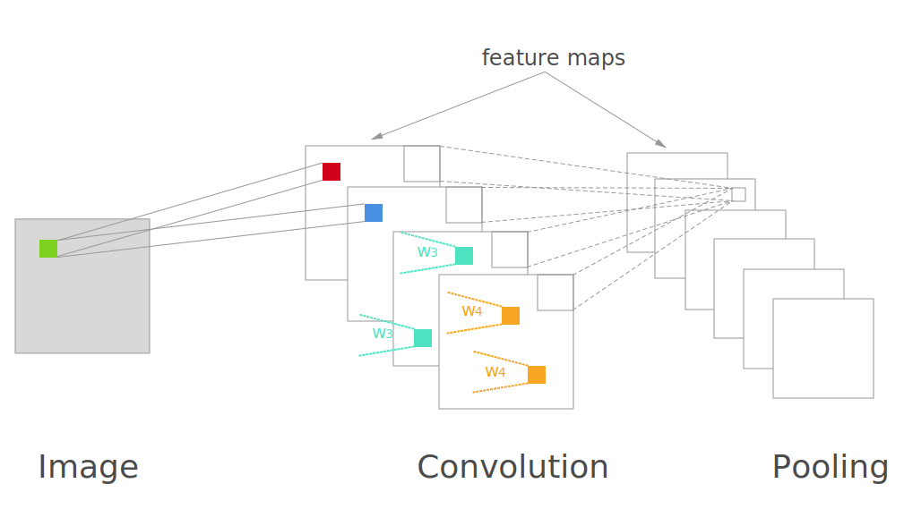
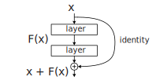

# Syllabus Map

* Study map: [Syllabus Study Map](/posts/syllabus/ioai-study-map/)

---
# Overview

* Convolutions extract local spatial patterns.
* Stacking layers builds hierarchical visual features.
* Residual connections help train deeper CNNs by improving gradient flow.

---

# Convolution Basics

## Core Idea


* Apply a learnable filter across the image.
* Capture edges, textures, and shapes.
* Weight sharing reduces parameters and improves translation robustness.

## Key Concepts

### Kernels

* A kernel is a small window of learnable weights.
* It slides across the input to detect local patterns.
* Kernel size controls how much context the filter sees.

### Stride

* Controls how far the kernel moves each step.
* Larger stride reduces spatial resolution.

### Padding

* Adds border pixels to preserve spatial size.
* Helps retain edge information.

### Output size

* Depends on input size, kernel size, stride, and padding.
* Use the formula below to compute $H_{out}$ and $W_{out}$.

* For input size $ H \times W $:
$$
H_{out} = \left\lfloor \frac{H + 2P - K}{S} \right\rfloor + 1
$$
$$
W_{out} = \left\lfloor \frac{W + 2P - K}{S} \right\rfloor + 1
$$
* **$H, W$**: input height and width.
* **$K$**: kernel size (assume square kernel for simplicity).
* **$P$**: padding size on each side.
* **$S$**: stride.
* **$H_{out}, W_{out}$**: output height and width.

### Channels and feature maps

* Input channels match the input (e.g., 3 for RGB).
* Output channels are different learned filters.
* Each output channel is a feature map highlighting a pattern.

### Convolution operation
* For input $ x $ and kernel $ w $:
$$
y_{i,j} = \sum_{u,v} w_{u,v}\,x_{i+u,\;j+v}
$$
* **$y_{i,j}$**: output value at spatial location $(i,j)$.
* **$w_{u,v}$**: kernel weight at offset $(u,v)$.
* **$x_{i+u, j+v}$**: input value under the kernel at position $(i,j)$.
* The sum is over the kernel window offsets $u,v$.

---

# CNN Overview (General Structure)

## Typical pipeline
* **Input** image (H × W × C).
* **Stem**: conv + norm + activation to get early edges/textures.
* **Stages**: repeated conv blocks with occasional downsampling (stride or pooling).
* **Head**: global pooling + linear classifier (or task-specific heads).

## Spatial hierarchy
* Early layers: edges and corners.
* Mid layers: textures and parts.
* Deep layers: objects and semantics.

---

# CNN vs Fully Connected (FC)

## Why CNNs dominate for images
* **Local connectivity**: filters see small neighborhoods first.
* **Weight sharing**: same filter across the image cuts parameters.
* **Translation tolerance**: same pattern can be detected anywhere.
* **Parameter efficiency**: FC layers explode in size for high-res inputs.

## When FC makes sense
* Small, fixed-size tabular inputs.
* As a final classifier head after convolutional features.

---

# Residual Connections

## Core idea

* Residual blocks add the input back to the output:
$$
y = F(x) + x
$$
* This helps gradients flow and enables **very deep** networks.

## Why residual learning helps
* **Degradation problem**: very deep plain CNNs can have **higher training error** than shallower ones.
* Learning a **residual** $F(x)$ is often easier than learning a full mapping $H(x)$ directly.
* If the optimal mapping is close to identity, then $H(x) \approx x$ and the residual $F(x) = H(x) - x \approx 0$, which is easier to optimize.

## Identity vs projection shortcuts
* **Identity shortcut**: $y = F(x) + x$ (same shape).
* **Projection shortcut**: use $1 \times 1$ conv to match channels/stride:
  * $y = F(x) + W_s x$.
  * Used when changing resolution or channel count.

## Gradient flow
* Skip connections create **short paths** for gradients.
* They **reduce** vanishing gradients but **do not eliminate** them completely.
* Optimization becomes easier even if generalization stays similar.

---

# PyTorch Implementation

## Core building blocks
```py
import torch
import torch.nn as nn

conv = nn.Conv2d(in_channels=3, out_channels=32, kernel_size=3, stride=1, padding=1)
bn = nn.BatchNorm2d(32)
relu = nn.ReLU()
pool = nn.MaxPool2d(kernel_size=2, stride=2)
```

## A simple CNN block
```py
class ConvBlock(nn.Module):
    def __init__(self, in_ch, out_ch):
        super().__init__()
        self.net = nn.Sequential(
            nn.Conv2d(in_ch, out_ch, 3, padding=1),
            nn.BatchNorm2d(out_ch),
            nn.ReLU(),
            nn.MaxPool2d(2)
        )

    def forward(self, x):
        return self.net(x)
```

## Residual block (basic)
```py
class ResidualBlock(nn.Module):
    def __init__(self, channels):
        super().__init__()
        self.conv1 = nn.Conv2d(channels, channels, 3, padding=1)
        self.bn1 = nn.BatchNorm2d(channels)
        self.conv2 = nn.Conv2d(channels, channels, 3, padding=1)
        self.bn2 = nn.BatchNorm2d(channels)
        self.relu = nn.ReLU()

    def forward(self, x):
        out = self.relu(self.bn1(self.conv1(x)))
        out = self.bn2(self.conv2(out))
        return self.relu(out + x)
```

---

# Dataset processing (PyTorch)

## Basic image dataset
```py
from torchvision import datasets, transforms

transform = transforms.Compose([
    transforms.Resize((224, 224)),
    transforms.ToTensor(),
    transforms.Normalize(mean=[0.485, 0.456, 0.406],
                         std=[0.229, 0.224, 0.225])
])

train_ds = datasets.ImageFolder("data/train", transform=transform)
val_ds = datasets.ImageFolder("data/val", transform=transform)
```

## DataLoader
```py
from torch.utils.data import DataLoader

train_loader = DataLoader(train_ds, batch_size=32, shuffle=True, num_workers=2)
val_loader = DataLoader(val_ds, batch_size=32, shuffle=False, num_workers=2)
```


