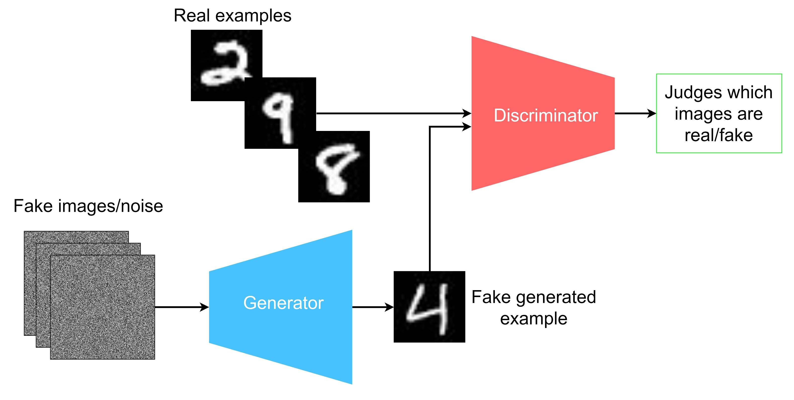
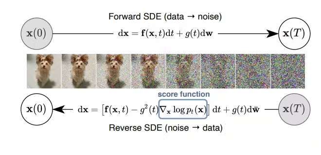

# Syllabus Map

* Study map: [Syllabus Study Map](/posts/syllabus/ioai-study-map/)

---
# Overview

* Generative models synthesise realistic images.
* Two major families are GANs and diffusion models.
* GANs are usually faster at sampling; diffusion models are usually more stable and higher quality.

---

# GAN (Generative Adversial Network)

## Core Idea

* **Generator** $G$ maps latent noise $z$ to an image $\hat{x}=G(z)$.
* **Discriminator** $D$ predicts whether an image is real ($x$) or generated ($G(z)$).
* Training is adversarial:

$$
\min_G \max_D \;
\mathbb{E}_{x\sim p_{\text{data}}}[\log D(x)] +
\mathbb{E}_{z\sim p(z)}[\log(1-D(G(z)))]
$$

* $p_{\text{data}}$ is the real image distribution.
* $p(z)$ is latent prior (typically Gaussian).

## Step-by-Step GAN Training

### Step 1: Sample data and latent vectors
* Draw real images $x$ from the dataset.
* Draw noise vectors $z\sim \mathcal{N}(0,I)$.

### Step 2: Update discriminator
* Train $D$ to assign high score to real images and low score to generated images.
* This improves real/fake separation.

### Step 3: Update generator
* Train $G$ to produce images that fool $D$.
* Generator gradients flow through discriminator feedback.

### Step 4: Alternate updates
* Repeat discriminator and generator updates.
* Keep training balanced to avoid one network overpowering the other.

## Important GAN Variants

* **DCGAN**: convolutional baseline for stable image generation.
* **WGAN / WGAN-GP**: Wasserstein objective + gradient penalty for improved stability.
* **StyleGAN2/3**: style-based generator with strong photorealism and controllability.

## Practical Notes

### Training stability is the main challenge

* GAN optimization can oscillate or diverge if updates are not balanced.

### Balance generator and discriminator updates

* Keep $G$ and $D$ learning rates and update frequencies well matched.

### Watch for mode collapse

* Generated samples may lose diversity even when quality appears high.

### Track quality with standard metrics

* FID and IS are common diagnostics alongside qualitative inspection.

---

# Diffusion Models

## Core Idea

### Denoising Process

* Learn to denoise from random noise to a data sample.
* Forward process gradually adds Gaussian noise to images.
* Reverse process learns to remove noise step-by-step.

### Markov Formulation

$$
q(x_t \mid x_{t-1}) = \mathcal{N}\!\left(\sqrt{1-\beta_t}\,x_{t-1}, \beta_t I\right)
$$

* The diffusion process is a Markov chain: each state depends only on the previous state, i.e., $q(x_t \mid x_{t-1})$.
* Here, $x_{t-1}$ is the sample at the previous step, $x_t$ is the noisier sample at step $t$, and $\beta_t$ is the step-$t$ noise variance.

### Model Components

* In most modern diffusion models, the denoiser is a **U-Net** that predicts noise at each timestep.
* In latent diffusion (for example Stable Diffusion), a **VAE** encodes images into latent space before diffusion and decodes latents back to pixels after denoising.

### Text Conditioning

* Text-conditioned models commonly use a **CLIP** text encoder to convert the prompt into embeddings used to condition the U-Net (typically via cross-attention).

## Step-by-Step Diffusion Training

### Step 1: Sample image and timestep
* Draw clean image $x_0$ (original data sample) and random timestep $t \in \{1,\dots,T\}$.

### Step 2: Add noise
* Sample $\epsilon \sim \mathcal{N}(0,I)$ and form noisy sample:

$$
x_t = \sqrt{\bar{\alpha}_t}x_0 + \sqrt{1-\bar{\alpha}_t}\,\epsilon
$$

* $\epsilon$ is sampled Gaussian noise, and $\bar{\alpha}_t = \prod_{s=1}^{t}(1-\beta_s)$ is the cumulative signal-retention factor up to step $t$.

### Step 3: Predict noise
* Train denoiser $\epsilon_\theta(x_t,t,c)$ to estimate the injected noise.
* $\epsilon_\theta(\cdot)$ is the model's predicted noise, and $c$ is optional conditioning input (for example text prompt).

### Step 4: Optimize denoising loss

$$
\mathcal{L}_{\text{simple}}=
\mathbb{E}_{x_0,\epsilon,t}\left[
\|\epsilon-\epsilon_\theta(x_t,t,c)\|_2^2
\right]
$$

### Step 5: Sample images
* Start from $x_T\sim \mathcal{N}(0,I)$, where $x_T$ is the near-pure noise state at the final diffusion step.
* Iteratively denoise from timestep $T$ down to $0$.

## Guidance and Samplers

### Classifier-free guidance (CFG)

* During training, randomly drop the condition $c$ some fraction of the time so the same model learns both conditioned and unconditioned predictions.

$$
\hat{\epsilon}=
\epsilon_\theta(x_t,t,\varnothing)+
w\left(\epsilon_\theta(x_t,t,c)-\epsilon_\theta(x_t,t,\varnothing)\right)
$$

* At inference, run the model twice (conditioned and unconditioned) and combine them with guidance scale $w$.
* $\varnothing$ denotes unconditioned input, and $w$ is guidance scale; larger values strengthen condition fidelity but can reduce diversity.
* Common samplers: DDPM, DDIM, and DPM-Solver variants.

### DDIM (Denoising Diffusion Implicit Models)

* DDIM uses a non-Markovian reverse process that can sample with fewer steps than DDPM.
* It can be deterministic ($\eta=0$), which makes generation faster and more consistent for the same seed.
* A common DDIM update is:

$$
x_{t-1} =
\sqrt{\bar{\alpha}_{t-1}}\,\hat{x}_0 +
\sqrt{1-\bar{\alpha}_{t-1}-\sigma_t^2}\,\hat{\epsilon}_\theta +
\sigma_t z,\quad z\sim\mathcal{N}(0,I)
$$

* Setting $\sigma_t=0$ (equivalently $\eta=0$) gives deterministic sampling; larger $\eta$ adds stochasticity and diversity.

## Practical Notes

### Delivers strong image quality

* Diffusion models are often strong on realism and diversity.

### Inference is usually slower than GANs

* Multiple denoising steps increase latency compared with one-pass generators.

### Latent diffusion improves efficiency

* Denoising in compressed latent space reduces memory and compute cost.

### Tune sampler controls carefully

* Noise schedule, denoising steps, guidance scale, and sampler strongly affect output behavior.

---

# GANs vs Diffusion (Quick Comparison)

* **Training stability**: diffusion usually easier to optimize.
* **Sampling speed**: GANs are usually faster (single pass).
* **Quality/diversity**: modern diffusion is usually stronger.
* **Conditioning**: diffusion integrates text/image guidance naturally.

