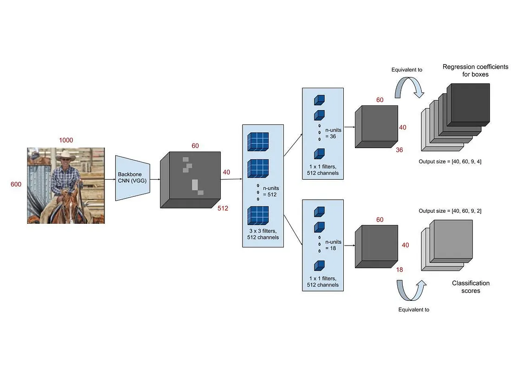

# Syllabus Map

* Study map: [Syllabus Study Map](/posts/syllabus/ioai-study-map/)

---
# Overview

* The R-CNN family introduced **region-based** object detection using explicit proposals.
* Each step improved compute reuse and training simplicity.
* The main evolution is: **R-CNN → Fast R-CNN → Faster R-CNN**.

---
# R-CNN

## Core idea
* Generate region proposals, then run a CNN on each proposal.
* Classify each region and refine its box.

## Pipeline
* **Selective Search** proposes ~2k regions per image.
* **Warp + CNN**: each proposal is warped to a fixed size (e.g., 227x227) and fed through a backbone like AlexNet or VGG.
* **SVMs**: one-vs-rest linear SVM per class on cached CNN features.
* **Box regressor**: class-specific linear regressors refine bounding boxes.

## How Selective Search Works (Step-by-Step)
### Step 1: Initial over-segmentation
* Split the image into many small regions (superpixels) using color/texture boundaries.

### Step 2: Compute region similarities
* Score neighboring regions by hand-crafted similarity cues: color histogram, texture, size, and fill.

### Step 3: Greedy merging
* Repeatedly merge the most similar neighboring region pair.
* After each merge, recompute similarities with new neighbors.

### Step 4: Generate proposals at all hierarchy levels
* Each merged region defines a candidate object region.
* Convert each candidate region to a bounding box proposal.

### Step 5: Remove duplicates
* Use simple deduplication and ranking to keep a manageable proposal set (around 2k).

### Step 6: Hand off to CNN stage
* R-CNN crops/warps each proposal and runs a separate CNN forward pass per proposal.

## Key traits
* **Accurate**, but extremely **slow** at inference.
* Multi-stage training: pretrain on ImageNet, fine-tune CNN on detection, then train SVMs + box regressors.
* Heavy disk usage to cache features for all proposals.

---
# Fast R-CNN

## Core idea
* Run the CNN **once per image**, then classify regions using pooled features.
* Reuse that shared feature map for all proposals instead of recomputing convolution features per region.

## Pipeline
* **Backbone CNN** produces a shared feature map.
* **RoI Pooling** converts each RoI into a fixed 7x7 feature map by quantized spatial binning.
* **Single head** outputs class scores (softmax) + box deltas for each RoI.

## Why "CNN Once Per Image" Is Better
* **R-CNN bottleneck**: if there are ~2k proposals, convolution is run ~2k times per image.
* **Fast R-CNN change**: run convolution once on the full image, then slice RoI features from the shared map.
* **Computation reuse**: overlapping proposals share most low/mid-level features, so repeated conv work is removed.
* **Memory/I-O improvement**: no need to cache per-proposal CNN features to disk.
* **Training simplification**: classification and box regression are learned jointly from shared features.

## Key traits
* Much faster than R-CNN.
* End-to-end training with a **multi-task loss** (classification + smooth L1 box regression).
* Still depends on **external proposals** (Selective Search).

---
# Faster R-CNN

## Core idea
* Replace external proposal generation with a **Region Proposal Network (RPN)**.

## Pipeline
* **Backbone CNN** shared by RPN and detection head.
* **RPN**: a 3x3 conv sliding over the feature map predicts objectness + anchor box offsets.
* **Anchors**: multiple scales and aspect ratios per location (e.g., 3 scales x 3 ratios).
* **RoI Pooling / RoI Align** extracts proposal features (RoI Align removes quantization).
* **Detection head** predicts class + refined box.

## How RPN Works (Step-by-Step)
### Step 1: Shared feature extraction
* Pass image through the backbone once to get a convolutional feature map.

### Step 2: Dense anchor placement
* At each spatial location, place $k$ anchor boxes with predefined scales and aspect ratios.

### Step 3: Sliding prediction heads
* A small RPN head predicts for each anchor:
  * Objectness score (foreground vs background),
  * Box regression offsets $(\Delta x, \Delta y, \Delta w, \Delta h)$.

### Step 4: Anchor labeling (training)
* Match anchors to ground-truth boxes by IoU thresholds to mark positive/negative anchors.
* Train with combined objectness + box regression loss.

### Step 5: Proposal decoding
* Convert anchor + predicted offsets into proposal boxes in image coordinates.
* Clip boxes to image boundaries and remove tiny/invalid boxes.

### Step 6: Proposal filtering
* Rank proposals by objectness, apply NMS, keep top proposals (for example top 300 at inference).

### Step 7: Hand-off to detector
* Send filtered proposals to RoI Pooling/RoI Align and then to the final classification/regression head.

## Key traits
* Fully end-to-end and much faster than Fast R-CNN.
* Strong accuracy-speed tradeoff for general detection.
* Typical inference keeps ~300 proposals after NMS (config dependent).

---
# Mask R-CNN

## Core idea
* Extend Faster R-CNN with a parallel **segmentation mask** prediction branch.

## Pipeline
* **Backbone + FPN** often used to improve multi-scale features.
* **RPN** generates proposals as in Faster R-CNN.
* **RoI Align** replaces RoI Pooling to avoid misalignment from quantization.
* **Two heads**: class + box regression, and a small FCN mask head that predicts a K x m x m mask per class.

## Key traits
* Adds instance segmentation with minimal overhead.
* Mask loss is **per-pixel sigmoid** (not softmax across classes).
* Requires precise RoI alignment for good mask quality.

---
# How They Differ

* **R-CNN**: per-region CNN, SVMs, slow.
* **Fast R-CNN**: shared CNN, RoI Pooling, still external proposals.
* **Faster R-CNN**: shared CNN + built-in RPN proposals.
* **Mask R-CNN**: Faster R-CNN + mask head with RoI Align.

---
# Training Objectives (High Level)

* **Classification loss**: object class per RoI.
* **Box regression loss**: refine bounding box coordinates.
* **RPN loss** (Faster R-CNN only): objectness + anchor box offsets.

---
# When To Use

* **R-CNN**: historical baseline, rarely used now.
* **Fast R-CNN**: useful for understanding the progression.
* **Faster R-CNN**: strong default for accurate detection.

---
# Practical Notes

## Fast R-CNN and Faster R-CNN usually train with SGD, momentum 0.9, and weight decay ~5e-4 (classic configs).

* Fast R-CNN and Faster R-CNN usually train with SGD, momentum 0.9, and weight decay ~5e-4 (classic configs).
## Faster R-CNN originally used **alternating training** (train RPN, then detector, then fine-tune jointly).

* Faster R-CNN originally used **alternating training** (train RPN, then detector, then fine-tune jointly).
## R-CNN style per-proposal CNN compute is ~2k forward passes per image, which dominates runtime.

* R-CNN style per-proposal CNN compute is ~2k forward passes per image, which dominates runtime.