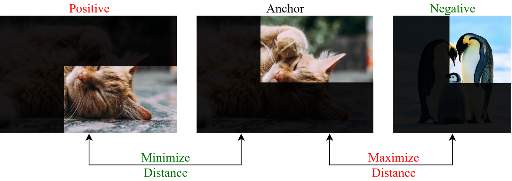

# Syllabus Map

* Study map: [Syllabus Study Map](/posts/syllabus/ioai-study-map/)

---
# Overview

* Self-supervised learning builds visual features without manual labels.
* The goal is to learn **general representations** that transfer to classification, detection, and segmentation.

---

# Core Ideas

## Pretext Tasks

* Predict masked patches (masked image modeling).
* Solve contrastive objectives with positive/negative pairs.
* Predict rotations, colorization, jigsaw order (classic but less used now).

## Representation Learning

* Learn embeddings that transfer to downstream tasks.
* Evaluate with **linear probes**, **k-NN**, or full fine-tuning.

---

# Main Families (Vision)

## Contrastive Learning

* **SimCLR**: two augmented views; maximize agreement with InfoNCE loss.
* **MoCo**: momentum encoder + queue of negatives for scalable contrast.
* **SwAV**: online clustering with multi-crop augmentation (no explicit negatives).

## Bootstrap / Non-Contrastive

* **BYOL**: online and target networks; stop-gradient avoids collapse.
* **SimSiam**: predictor head + stop-gradient, no negatives.

## Masked Image Modeling

* **MAE**: mask large portions of patches, reconstruct pixels with a decoder.
* **BEiT**: predict discrete visual tokens (like a visual vocabulary).

---

# Step-by-Step: Contrastive Learning Objectives

## Objective 1: Instance Discrimination (Image-Level)

* Treat each image instance as its own class using two augmented views.
* Pull the positive pair together and push all other images in the batch away.

$$
s(a, b) = \frac{a^T b}{\|a\| \|b\|}
$$

$$
L_i = -\log \left(
\frac{\exp(s(z_i, z_i^+) / \tau)}
{\sum_{k \ne i} \exp(s(z_i, z_k) / \tau)}
\right)
$$

$$
L_{\text{batch}} = \frac{1}{2N} \sum_{i=1}^{2N} L_i
$$

## Objective 2: Image Subsampling / Patching (Patch-Level)

* Split image features into local patches (or crop local regions) and contrast local positives against negatives.
* Positives can be two views of the same patch location/region; negatives are other patches or other images.

$$
L_{\text{patch}}(i, p) = -\log \left(
\frac{\exp(s(z_{i,p}^a, z_{i,p}^b) / \tau)}
{\sum_{(j,q) \ne (i,p)} \exp(s(z_{i,p}^a, z_{j,q}) / \tau)}
\right)
$$

$$
L_{\text{total}} = \lambda_{\text{img}} L_{\text{batch}} + \lambda_{\text{patch}} \frac{1}{P} \sum_{p=1}^{P} L_{\text{patch}}(:, p)
$$

---

# Step-by-Step: Instance Discrimination

## Step 1: Sample a Batch

* Draw a mini-batch of unlabeled images.
* Larger batches provide more in-batch negatives.

## Step 2: Create Two Augmented Views
* Apply two random augmentation pipelines to each image.
* Typical transforms: random crop, color jitter, blur, flip.

## Step 3: Encode and Project

* Encode each view with a shared encoder $f$.
* Map encoder features through a projection head $g$ to get $z$.

$$
h_i = f(x_i), \quad z_i = g(h_i)
$$

## Step 4: Build Positive/Negative Sets

* Positive pair: two views from the same original image.
* Negatives: all other views in the current batch (or memory queue in MoCo).

## Step 5: Optimize InfoNCE

* Compute pair similarities and temperature-scaled softmax.
* Backpropagate $L_batch$ to update $f$ and $g$.

## Step 6: Transfer Encoder

* Discard $g$ after pretraining.
* Use $f$ for linear probing or end-to-end fine-tuning.

---

# Step-by-Step: Image Subsampling / Patching

## Step 1: Generate Local Regions or Tokens

* Create patches by ViT tokenization or region crops from CNN feature maps.
* Produce two views so corresponding patches can be matched.

## Step 2: Encode Local Features

* Extract patch embeddings from both views.
* Optionally add a patch-level projection head.

$$
h_{i,p} = f(x_i, p), \quad z_{i,p} = g_{\text{patch}}(h_{i,p})
$$

## Step 3: Define Patch Positives and Negatives

* Positive: matched patch/region across two augmented views.
* Negatives: unmatched patches in the same image and patches from other images.

## Step 4: Compute Patch Contrastive Loss

* Apply patch-level InfoNCE for each selected patch.
* Average across patches, then combine with image-level loss if used.

$$
L_{\text{total}} = \lambda_{\text{img}} L_{\text{batch}} + \lambda_{\text{patch}} L_{\text{patch\_avg}}
$$

## Step 5: Update and Transfer

* Optimize encoder and projection heads jointly.
* Keep the encoder for downstream dense tasks (segmentation, detection) or classification.

---

# Key Design Choices

* **Augmentations**: random crop, color jitter, blur, solarize, and horizontal flip are critical for contrastive methods.
* **Backbones**: ResNet for early SSL, ViT is now common for MIM.
* **Projection head**: MLP head often improves representation quality.
* **Losses**: InfoNCE for contrastive, cosine regression for BYOL/SimSiam, reconstruction loss for MAE.

---

# Practical Notes

* Requires large, diverse datasets.
* Contrastive methods are compute-heavy due to multiple views per image.
* Masked image modeling scales well with ViT and large datasets.
* Often used before supervised fine-tuning.
* Linear probing is the fastest way to compare SSL methods fairly.

