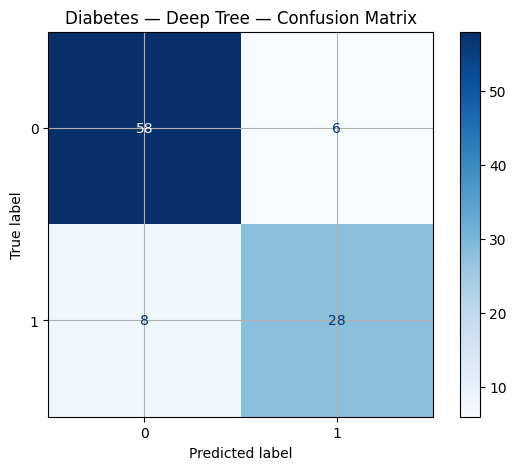
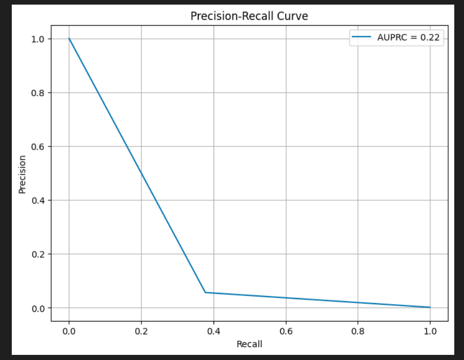

# Syllabus Map

* Study map: [Syllabus Study Map](/posts/syllabus/ioai-study-map/)

---
# Overview

* Metrics define what "good" means for your model.
* Different tasks and error costs require different metrics.
* Always combine summary scores with error diagnostics.

---

# Classification Metrics

## Accuracy

* Formula: $ \frac{TP + TN}{TP + TN + FP + FN} $.
* Best when classes are balanced.
* Can be misleading under class imbalance.
* When to use: balanced-class problems where FP and FN have similar cost.

## Precision

* Formula: $ \frac{TP}{TP + FP} $.
* Answers: how many predicted positives are correct.
* Prioritize when false positives are costly.
* When to use: spam detection, fraud alerts, or moderation systems where false alarms are expensive.

## Recall

* Formula: $ \frac{TP}{TP + FN} $.
* Answers: how many true positives were found.
* Prioritize when false negatives are costly.
* When to use: medical screening, safety monitoring, or anomaly detection where misses are expensive.

## F1-score

* Formula: $ 2 \cdot \frac{\text{Precision} \cdot \text{Recall}}{\text{Precision} + \text{Recall}} $.
* Balances precision and recall.
* Useful when one metric alone is insufficient.
* When to use: imbalanced classification when you need one score that balances FP and FN.

## Balanced Accuracy

* Formula: $ \frac{1}{2}(\text{TPR} + \text{TNR}) $.
* Better for unequal class sizes.
* Equivalent to mean recall across classes in binary settings.
* When to use: imbalanced binary tasks where standard accuracy would overstate majority-class performance.

## Macro vs Micro Averaging

* Macro: average per class, treating classes equally.
* Micro: aggregate counts globally, weighting by class frequency.
* Use macro when minority classes matter more.
* When to use macro: multi-class settings where each class should contribute equally.
* When to use micro: multi-class settings where overall instance-level performance is the priority.

---

# Diagnostic Tools

## Confusion Matrix

* Shows TP, FP, TN, and FN structure directly.
* Makes specific failure types visible.
* Helps identify systematic class confusions.

## ROC Curve and AUC

* ROC plots TPR vs FPR across thresholds.
* AUC summarizes threshold-free ranking quality.
* Useful for comparing classifiers with varying thresholds.

## PR Curve

* Plots precision vs recall across thresholds.
* Often more informative than ROC under heavy imbalance.
* Focuses on positive-class performance.

## Calibration

* Reliability diagrams and Brier score check probability quality.
* A well-calibrated model's predicted probabilities match observed frequencies.

---

# Regression Metrics

## MSE

* Formula: $ \frac{1}{n}\sum_{i=1}^n (y_i - \hat{y}_i)^2 $.
* Penalizes large errors heavily.
* Common for optimization due to smooth gradients.

## MAE

* Formula: $ \frac{1}{n}\sum_{i=1}^n |y_i - \hat{y}_i| $.
* More robust to outliers than MSE.
* Interpretable in target units.

## $R^2$

* Formula: $ 1 - \frac{\sum (y_i - \hat{y}_i)^2}{\sum (y_i - \bar{y})^2} $.
* Measures variance explained by the model.
* Can be negative if performance is worse than mean prediction.

## MAPE

* Formula: $ \frac{100}{n}\sum \left|\frac{y_i-\hat{y}_i}{y_i}\right| $.
* Gives percentage error.
* Avoid when true values are near zero.
