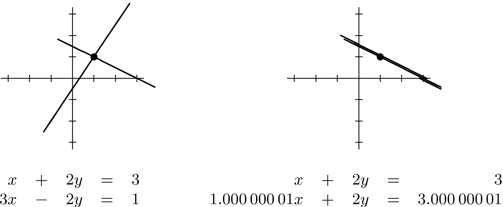

# Syllabus Map

* Study map: [Syllabus Study Map](/posts/syllabus/ioai-study-map/)

---

# Core Idea

* Determinant describes signed area/volume scaling of a linear map.
* Invertibility means a unique reverse mapping exists.

## What Determinant Means

* Think of a matrix $A$ as a transformation of space.
* $\lvert \det(A) \rvert$ tells how much $A$ scales area (in 2D) or volume (in 3D).
  * $\lvert \det(A)\rvert = 3$ means areas/volumes become 3 times larger.
  * $\lvert \det(A)\rvert = 0.2$ means they shrink to one-fifth.
* The sign of $\det(A)$ tells orientation:
  * $\det(A) > 0$: orientation preserved.
  * $\det(A) < 0$: orientation flipped (reflection involved).
* $\det(A)=0$ means at least one dimension is collapsed, so information is lost.
* Geometric picture:
  * In 2D, $A$ maps the unit square to a parallelogram.
  * In 3D, $A$ maps the unit cube to a parallelepiped.
  * The area/volume of that transformed shape is exactly $\lvert\det(A)\rvert$.

## What Invertibility Means

* $A$ is invertible if every output comes from exactly one input.
* Equivalent statements:
  * Columns of $A$ are linearly independent.
  * $\operatorname{rank}(A)$ is full.
  * The equation $Ax=b$ has a unique solution for every $b$.
* If $A$ is not invertible (singular), multiple inputs can map to the same output, so no unique reverse exists.
* Geometric picture:
  * If $A$ flattens space (for example, a plane to a line), different points collapse to the same output.
  * Once points overlap after transformation, a unique reverse map is impossible.
* Quick visual test in 2D:
  * Compute $Ae_1$ and $Ae_2$ (images of basis vectors).
  * If they are collinear, transformed area is zero $\Rightarrow \det(A)=0$ and $A$ is not invertible.
  * If they are not collinear, transformed area is nonzero $\Rightarrow \det(A)\ne 0$ and $A$ is invertible.

## Key Formulas

For $2\times2$ matrix:
$$
A=\begin{bmatrix}a & b\\ c & d\end{bmatrix},\quad \det(A)=ad-bc
$$

$$
A^{-1}A = I, \quad \det(A)\ne 0 \Leftrightarrow A \text{ invertible}
$$

## Quick Example

$$
A=\begin{bmatrix}1 & 2\\ 2 & 4\end{bmatrix}
$$

* Here, $\det(A)=1\cdot4-2\cdot2=0$.
* The second row is a multiple of the first, so the matrix collapses 2D space onto a line.
* Therefore $A$ is singular and has no inverse.

## Practical Notes

### Determinant near zero implies numerical instability.

* Systems become ill-conditioned even before exact singularity.

### Avoid explicit inverse when solving systems.

* Prefer stable solvers (`solve`, factorisation methods).

## Why This Matters for ML

* Invertibility and conditioning explain why some regression problems are numerically unstable.
* Near-singular matrices produce large parameter swings from small data perturbations.
* Regularised objectives (for example Ridge) improve conditioning by shifting spectra.
* Determinant-based terms also appear in Gaussian likelihoods and normalising transformations.
