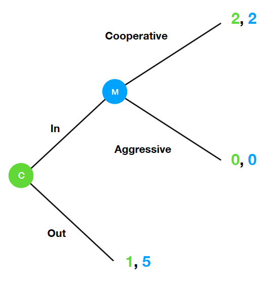

# SMU H3 Map

* Content map: [SMU H3 Game Theory Map](/posts/game-theory/smu-h3/)

---

# Ultimatum Game

## Definition
A negotiation where one player makes a **“take it or leave it”** offer to another player.

- The person who offers is the **proposer**
- The person who answers is the **recipient**

---

# Game Tree
- Games can be represented as a combination of every choice made with every payoff made

- Given the game tree below, we can conduct **backward induction** to identify the **rollback equilibrium**

## Rollback Equilibrium of Player 2
- Starting from the left subtree, the best outcome for this subtree is (0, 2)

- For the right subtree, the best outcome for this subtree is (1, 4)

## Strategies for a Player

- P2's strategies are a choice at each node
- Thus, the table below represents all the strategies for P2
  - (u, u)
  - (u, d)
  - (d, u)
  - (d, d)

---

#  Game

## Rules
- The proposer chooses how many coins to give the recipient.
- The recipient can **accept** or **reject**.
- If the recipient rejects, **both parties get nothing**.

## Ingredients

### Players
- 2 players
- 1 proposer, 1 recipient

### Information Structure
- One player moves first (proposer), then the second player (recipient).
- The recipient knows the proposer’s strategy when making the decision.

### Strategy
- Proposer decides how much to offer.
- Recipient decides whether to accept or reject based on the amount.

## Payoff
Let $(x, 10 - x)$ denote the proposed split.

- **Proposer** → $x$ if accepted, 0 otherwise  
- **Recipient** → $10 - x$ if accepted, 0 otherwise  

## Backward Induction

Let $(x, 10 - x)$ denote the proposed split.

### Case 1: If $x > 0$
- Proposer → $x$  
- Recipient → $10 - x$, since $10 - x > 0$

### Case 2: If $x = 0$
- Recipient → 0 if accept, 0 if reject  
- Proposer → 10 if accept, 0 if reject  

## Plausible Scenarios

1. **Recipient accepts all offers**  
   → Proposer’s best split: $(10, 0)$

2. **Recipient accepts offers where payoff > 0**  
   → Proposer’s best split: $(9, 1)$

## Rollback Equilibrium

Defined by the pair of strategies (one per player) that emerge from backward induction.

### Scenarios
1. $(0,\ \text{accept any offer})$  
2. $(1,\ \text{accept positive offers})$

---

# Extension 1: Inequality-Averse Recipient

Now assume the recipient cares about the **difference**:

$$
(10 - x) - x = 10 - 2x
$$

instead of just $10 - x$.

## Strategy

- **Accept** → Payoff = $10 - 2x$  
- **Reject** → Payoff = 0  

## Optimal Strategy

### Best answer is **YES** when:
- $(4, 6)$
- $(3, 7)$
- $(2, 8)$
- $(1, 9)$
- $(0, 10)$

### Best answer is **NO** when:
- $(6, 4)$
- $(7, 3)$
- $(8, 2)$
- $(9, 1)$
- $(10, 0)$

Since $ 10 - 2x < 0 $ , when the split is $(5, 5)$
Both **yes** and **no** are equally optimal answers.

## Rollback Equilibria

1. $(0,\ \text{accept any offer})$  
2. $(1,\ \text{accept positive offers})$

## Moral of the Story
- In labs, the split ratios go from 50:50 to 60:40
- Monetary gains and losses might not be the only factor influencing 
- **Neuroeconomics** can help in understanding these determinants
- The Neural Basis of Economic Decision-Making in the Ultimatum Game
- https://doi.org/10.1126/science.1082976

--- 

# Extension 2: Counter-Offers
- What if the recipient can make a counter-offer? 

## Rules
- Agreeing to $ x $ in the second round is payoff equivalent to agreeing to $ \delta x $ in the first round, where $ 0 < \delta < 1 $
- The pie to split has size 1, where any real number $ x \in [0, 1] $ can be offered
- This means that :
  - P1's split is of the form $ (x, 1-x) $
  - P2's split is of the form $ (y, 1-y) $

## Backward Induction
### Round 2
- P2 offers a split of $ (1-y, y) $
  - If yes, P1 obtains $ 1-y $
  - If no, P1 obtains $ 0 $
- **Yes** to any split since $ y \in [0, 1]$, thus $ 1-y \in [0, 1]$
- P2 offers $ (0, 1) $

### Rollback to Round 1
- P1 proposes a split of $ (x, 1-x) $
  - If yes, P1 obtains $ 1-x $
  - If no, the game moves to stage 2, P2 will get $ \delta $

### Conclusion
- P1's best response is :
  - **Yes** for all $ x $ such that $ 1-x \ge \delta$, which is equivalent to $ x \le 1-\delta$
  - **No** otherwise
  - The best split P1 can offer is $(1 - \delta, \delta)$

## Rollback Equilibrium
### P1's Strategy
- In round 1, offer the split $ (1-\delta, \delta) $
- In round 2, accept any proposed split $ (1-y, y) $

### P2's Strategy
- In round 1, offer the split $ (0, 1) $
- In round 2, accept any proposed split $ (x, 1-x) $ where $ x \le 1-\delta $

# Entry Game
## Rules
- Monopolist faces a threat by a challenger
- The challenger may decide to enter the market
- Upon entry, the monopolist will decide to price aggressively or cooperatively
- Monopolist prefers *no entry to entry*, and *collusion to competition*
- Challenger prefers entry *only under collusion*

## Game Tree

## Rollback Equilibrium
- Challenger should enter the market, and cooperate to maximise payoff
- Monopolist can improve the outcome by *cutting off the branch* which results in the suboptimal rollback equilibrium
- This can be done by setting a precedent that they **will not cooperate**