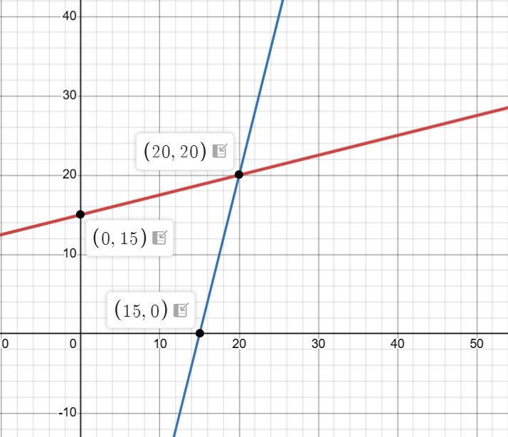

# SMU H3 Map

* Content map: [SMU H3 Game Theory Map](/posts/game-theory/smu-h3/)

---

# Choice Games with Continuous Strategies
## Comments
* Strategies are subsets of real numbers
* Make use of calculus whenever possible

## Price Competition with Imperfect Substitutes (Duopoly)
* **Coke** vs. **Pepsi**: Price competition or quantity competition
* **Electoral competition**: Campaign spending to win votes
* **Mediacorp Subaru Impreza Challenge**: Last person to take hand off car wins it

# Price Competition Game
## Consider the duopoly pricing game between **Coke** and **Pepsi**
### Notes 
* **Price rigid market structure**: Demand does not change dramatically with a change in price of substitute

### Setup
$$
\text{let } x \text{ be the quantity of Coke that buyers are willing to buy given } p \text{ and } q \\
x = 44 - 2 p + q
$$

$$
\text{let } y \text{ be the quantity of Pepsi that buyers are willing to buy given } p \text{ and } q \\
y = 44 - 2 q + p
$$

$$
\text{MC (marginal cost) is } 8 \text{ for each firm}
$$

### Payoffs

$$
\text{payoff} \equiv \text{profits}
$$

$$
\pi = \text{total revenue (TR)} - \text{total cost (TC)}
$$

$$
\text{TR}_\text{coke} = p \cdot x, \quad \text{TC}_\text{coke} = 8x \\
\pi_\text{coke} = p x - 8x = (p - 8) (44 - 2p + q)
$$

$$
\text{TR}_\text{pepsi} = q \cdot y, \quad \text{TC}_\text{pepsi} = 8y \\
\pi_\text{coke} = q x - 8x = (p - 8) (44 - 2q + p)
$$

### Best Response Analysis
1) Derive each firm's best response
2) Find $ (p, q) $ that satisfy both best responses

#### Suppose $ q = 20 $, what is the value of $ p $ that maximises $ \pi_\text{coke} $

$$
\pi_\text{coke} = (p - 8) (44 - 2p + 20) = (p - 8)(64 - 2p) \\
\pi_\text{coke} = -2(p - 8)(p - 32)
$$

$$
\frac{d \pi_\text{coke}}{dp} = -4p + 80 \\
4p = 80 \\
p = 20 \\
$$

$$
\therefore p_\text{max} = 20 \\
\therefore \pi_\text{coke} = 288
$$

#### Suppose $ q = 40 $, what is the value of $ p $ that maximises $ \pi_\text{coke} $

$$
\pi_\text{coke} = (p - 8) (44 - 2p + 40) = (p - 8)(84 - 2p) \\
\pi_\text{coke} = -2(p - 8)(p - 42)
$$

$$
\frac{d \pi_\text{coke}}{dp} = -4p + 100 \\
4p = 100 \\
p = 25 \\
$$

$$
\therefore p_\text{max} = 25 \\
\therefore \pi_\text{coke} = 34
$$

### Conclusion
* You can be repeated over and over, OR
* You can simply compute the best $ p $ for an unspecified $ q $ and then express the best $ p $ as a *"function"* of $ q $

### First-order condition for Coke
$$
\text{FOC:} \quad \pi_\text{coke}' = [(44 - 2p + q) - 2(p - 8)] \\
$$
$$
p = \frac{1}{4}(q + 60)
$$

### First-order condition for Pepsi
$$
\text{FOC:} \quad \pi_\text{pepsi}' = [(44 - 2q + p) - 2(q - 8)] \\
$$
$$
q = \frac{1}{4}(p + 60)
$$

### Diagram representation

* Nash equilibrium is obtained when when $ p = q $ and it meets both FOCs

$$
p = \frac{1}{4}(q + 60), \quad
q = \frac{1}{4}(p + 60)
$$

$$
p = 20, \quad q = 20
$$

* Nash equilibrium is (20, 20)
* Associated profits are (288, 288)
* Could the firms do better? (Collusion)

---

# Collusive Game
## Comments
* Fixing the prices to make **bigger** profits
* One model of collusion is: both Coke and Pepsi act as if they are under the same ownership
* Monopoly chooses both $ p $ and $ q $ to maximise $ \pi $ (profits)

## Optimisation Goal
$$
p, q = \argmax_{p, q} {[(p-8)(44-2p+q) + (q-8)(44-2q+p)]}
$$

| First-order condition w.r.t. $ p $ | First-order condition w.r.t. $ q $ |
| :-: | :-: |
| $$ \frac{\partial \pi}{\partial p} = 0 $$ | $$ \frac{\partial \pi}{\partial q} = 0 $$ |
| $$ 60 - 4p + q + (q - 8) = 0 $$ | $$ (p - 8) + 60 - 4  q + p = 0 $$|

## Outcome

$$
p_\text{max} = 26 > 20, \quad q_\text{max} = 26 > 20
$$

$$
\pi = (26 - 8)(44 - 26 \cdot 2 + 26) = 18^2 = 324 > 288
$$

* Clearly, firms prefer to collude to maximise profits

* However, this is not a Nash equilibrium
$$
\text{if } q = 26, p = 21.5
$$

* Even if firms agree to collude, they can gain from deviating if the other firm remains at $ q = 26 $

---

# Positional Externalities
## Definition
* People feel **worse off** when others obtain **better or more** of the **same** scarce goods
* This creates an **"arms race"** where everyone spends more just to keep up in relative standing
* The result is **inefficient overconsumption** and lower social welfare (e.g., bigger houses or expensive strollers)

## Setup
* 2 candidates are running for office in a presidential election

* Suppose P1 spends $ x $ in campaigning, P2 spends $ y $ in campaigning

* This is a simultaneous choice game

* P1's and P2's payoffs are:
$$
\pi_1 = 
\begin{cases}
\frac{10x}{x+y} - x \quad \text{if } x \ne 0 \text{ or } y \ne 0\\
5 \quad \text{if } x = y = 0
\end{cases}
$$

$$
\pi_2 = 
\begin{cases}
\frac{10y}{x+y} - x \quad \text{if } x \ne 0 \text{ or } y \ne 0\\
5 \quad \text{if } x = y = 0
\end{cases}
$$

## Best Response Analysis
### Verify that (0, 0) is not a Nash equilibrium
* Does not require calculus
* Just show that one player needs to deviate to gain

$$
\pi_1 = 5 \quad \text{if } x = y = 0
$$

$$
\pi_1 = 10 \cdot (\frac{0.1}{0.1}) - 0.1 = 9.9 > 5 \quad \text{if } x = 0.1, \space y = 0
$$

### Perform best response analysis
* Assuming $ x \ne 0, \space y \ne 0 $

#### FOC for P1
$$
\pi_1' = \frac{10 y}{(x + y)^2} - 1 = 0 \\
10 y = (x + y)^2
$$

#### FOC for P2
$$
\pi_2' = \frac{10 x}{(x + y)^2} - 1 = 0 \\
10 x = (x + y)^2
$$

#### Equality of FOC
* By comparing $ FOC_x $ and $ FOC_y $,  we can conclude that
$$
x = y 
$$

$$
10x = (2x)^2 = 4x^2 \\
x = y = 2.5
$$

* Thus, (2.5, 2.5) is a Nash equilibrium

### Collusion
$$
\pi_t = \pi_1 + \pi_2
$$

$$
\pi_t = \frac{10x}{x+y} - x + \frac{10y}{x+y}-y = 10 - x - y
$$

$$
\pi_t 
\begin{cases}
10 - x - y \quad \text{if } x \ne 0, \space y \ne 0 \\
10 \quad \quad \text{if } x = y = 0
\end{cases}
$$

---

# Assurance Game
## Payoff Matrix
| P2 \ P1 | Red | Black |
|:-:|:-:|:-:|
| **Red** | 2, 2 | 0, 0 |
| **Black** | 0, 0 | 5, 5 |

* Nash Equilibria occur at $(Red, Red)$ and $(Black, Black)$
* In this case, choosing $(Black, Black)$ might seem more logical since the payoff is higher than $(Red, Red)$
* $(Black, Black)$ Pareto dominates $(Red, Red)$, meaning that both players will be better off by doing so
* **Pareto Efficiency**: We say that $ (a, b) $ is Pareto efficient if it is to not possible to find another outcome in the game where at least 1 player is better off and no other player is worse off

---

# Stag Hunt Game
## Payoff Matrix
| P2 \ P1 | Stag | Hare |
|:-:|:-:|:-:|
| **Stag** | 5, 5 | 0, 3 |
| **Hare** | 3, 0 | 4, 4 |

* Nash equilibria at $ (Stag, Stag) $ and $ (Hare, Hare) $
* $ (Stag, Stag) $ gives the Pareto efficient outcome 
* $ (Hare, Hare) $ is the risk-dominant Nash equilibrium
* Assuming that the other player will choose $ Stag $ or $ Hare $ with the same frequency:
  * Choosing $ Stag $: Expected payoff is $ \frac{5 + 0}{2} = 2.5 $
  * Choosing $ Hare $: Expected payoff is $ \frac{3 + 4}{2} = 3.5 $

---

# Chicken Game
## Payoff Matrix
| P2 \ P1 | Swerve | Straight |
|:-:|:-:|:-:|
|  **Swerve**  | 1, 1 |  0,  2 |
| **Straight** | 2, 0 | -1, -1 |

* Nash equilibria at $ (Straight, Swerve) $ and $ (Straight, Swerve) $
* Both combinations of strategies are Pareto efficient

## Evolutionary Biology
* Payoffs indicate expected off-springs 
* Animals from same species (e.g. birds) meet at random
* Birds are genetically programmed to choose one strategy 
* The strategy that gets more off-springs survives evolutionary pressures
* This represents a form of a mixed strategy