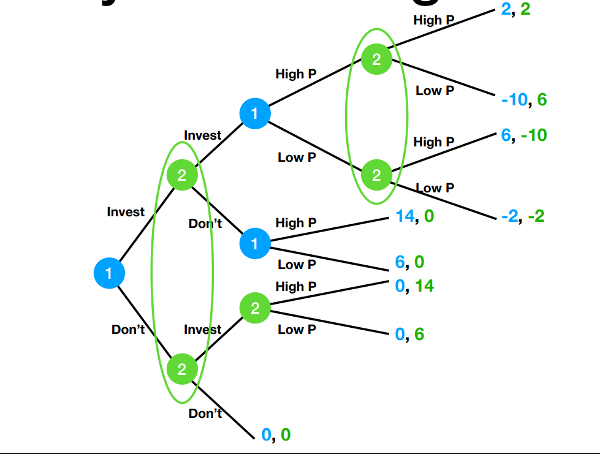
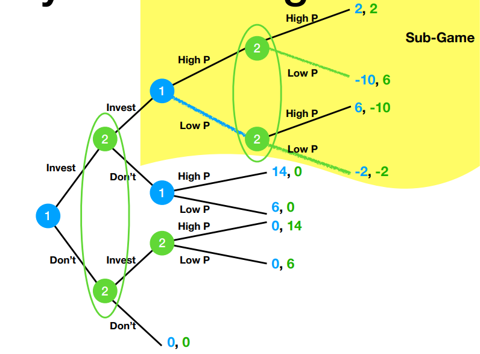

---
title: H3 Game Theory Session 5
published: 2026-02-06
description: "SMU H3 Game Theory Session 5 Notes"
tags: ["Game Theory", "Economics", "SMU H3"]
category: SMU H3 Notes
draft: false
---

# SMU H3 Map

* Content map: [SMU H3 Game Theory Map](/posts/syllabus/smu-h3-study-map/)

---

# Sub-Games and Sub-Game Perfect Equilibria
## Definition of Sub-Game
* Part of the game tree that starts at a single node and that can be considered as a Game in isolation
* This means that it can be computed separately using backward induction
* This helps calculating the Nash equilibrium when the game reaches the state of a sub-game
* The individual decision problem can be replaced with the Nash equilibrium outcome, as it is anticipated that the players will play rationally

## Definition of Sub-Game Perfect Equilibrium
* Replaces the rollback equilibrium
* A pair of strategies, one per player, that constitute an equilibrium in all sub-games
* This means every set of strategies which results in a Nash equilibrium in every subgame
* This can be found using backward induction

# Entry and Pricing Game 
## Setup

* When a circle is made around two choices, it means the player is unaware of the decisions made by the other player
* This allows simultaneous games to be mapped out as game trees

## Idenitfying Sub-games 

* Sub-games can be obtained when games are broken down into its component branches
* This simplifies the games as each game can be considered as being isolated
* In this game, there are 4 subgames:
  * **Subgame 1**: $ (Invest, Invest ) $
  * **Subgame 2**: $ (Invest, Don't) $
  * **Subgame 3**: $ (Don't, Invest) $

## Breaking down subgames
### Subgame 1
| P2 \ P1 | High P | Low P |
| --- | --- | --- |
| **High P** | 2, 2 | -10, 6 |
| **Low P**  | 6, -10 | -2, -2 |
* For P1, the option of *High P* is dominated by *Low P*
* For P2, the option of *High P* is dominated by *Low P*
* There is a weakly dominant strategy of *Low P* for both players, even if the Pareto efficient strategy is *High P*

### Subgame 2
| P2 \ P1 | High P | Low P |
| --- | --- | --- |
| **High P** | 2, 2 | -10, 6 |
| **Low P**  | 6, -10 | -2, -2 |
* For P1, the option of *High P* is dominated by *Low P*
* For P2, the option of *High P* is dominated by *Low P*
* There is a weakly dominant strategy of *Low P* for both players, even if the Pareto efficient strategy is *High P*

### Subgame 3
| P2 \ P1 | High P | Low P |
| --- | --- | --- |
| **High P** | 2, 2 | -10, 6 |
| **Low P**  | 6, -10 | -2, -2 |

## How to write strategies in each subgame
* P1 chooses in $ SG_1 $ and $ SG_2 $
* P2 chooses in $ SG_1 $ and $ SG_3 $
* The subgame perfect equilibria are:
$$
\bigg(\{ \text{invest}, (\overbrace{\text{low P}}^{SG_1}, \overbrace{\text{high P}}^{SG_2}) \}, \quad \{ \text{don't}, (\overbrace{\text{low P}}^{SG_1}, \overbrace{\text{high P}}^{SG_3}) \}\bigg)
$$

$$
\bigg(\{ \text{don't}, (\overbrace{\text{low P}}^{SG_1}, \overbrace{\text{high P}}^{SG_2}) \}, \quad 
\{ \text{invest}, (\overbrace{\text{low P}}^{SG_1}, \overbrace{\text{high P}}^{SG_3}) \}\bigg)
$$

* Even if $ SG_3 $ is never reached if players play rationally, it is still necessary since possibilities for each subgame are needed to represent

# Public Good Provision
## Setup (First Setup)
* Simultaneous decision making
* There are 3 players
* Each player decides whether to provide or not to provide the public good
* If at least 2 players choose to provide the public good, the public good is provided

| Player Contributes \ Public Good Provided | No | Yes |
| --- | --- | --- |
| **No**  | 2 | 4 |
| **Yes** | 1 | 3 |

## Subgame Perfect Equilibrium
* P1 has a choice at node 0
* P2 has a choice at node 1 and node 2
* P3 has a choice at node 4, node 5, node 6, node 7

* This is represented by:
$$
\{ N, (N, Y), (N, Y, Y, N) \}
$$
* The payoffs are $ (4, 3, 3) $ 

---

# In-Out Game
## Setup
* There are two players
* If P1 chooses out, the payoff is $ (2, 0) $
* If P1 chooses in, P1 and P2 play a simultaneous choice game

| P1 \ P2 | U | D | 
| --- | --- | --- |
| **U** | 3, 1 | -1, -1 |
| **D** | -1, -1 | 1, 3 |

## Subgame Perfect Equilibria
### Case 1:
* P1 chooses IN
* Players pick $(U, U)$
* Payoff is $(3, 1)$
* For P1, payoff of 3 > 2 
* Sub-Game Perfect equilibrium of $ ((\text{IN}, \text{U}), \text{U}) $

### Case 2:
* P1 chooses IN
* Players pick $ (D, D) $
* Payoff is $(1, 3)$
* For P1, payoff of 1 < 2 
* Sub-Game Perfect equilibrium of $ ((\text{OUT}, \text{D}), \text{D}) $

---

# Feds vs. Congress Game
## Setup
* 2 Players, Feds and Congress
* Feds (P2) pick interest rate (monetary policy)
* Congress (P1) picks budget spending (fiscal policy)

| Congress \ Feds | Low IR | High IR |
| --- | --- | --- |
| Budget Balance | 3, 4 | 1, 3 |
| Budget Deficit | 4, 1 | 2, 2 |

## Analysis (original)
* For P1, ***Budget Deficit*** dominates ***Budget Balance***
* For P2, 
  * If P1 chooses Budget Balance, Low IR gives a higher payoff
  * If P1 chooses Budget Deficit, High IR gives a higher payoff
* The Nash Equilibrium is (Budget Deficit, High IR)

## New Rules
* Changing order of play:
  * From simultaneous game to sequential game
  * Congress chooses first
  * Feds set the interest rates afterwards

## Analysis (new rules)
* Let $ SG_0 $, $ SG_1 $ and $ SG_2 $ be the three subgames

### Sub-Game 1 (Budget Balance)
* The Nash Equilibrium is $ (Balance, Low) $ 
* This results in a payoff of $ (3, 4) $

### Sub-Game 2 (Budget Deficit)
* The Nash Equilibrium is $ (Deficit, High) $ 
* This results in a payoff of $ (2, 2) $

### Sub-Game 0 (Starting Decision)
* The Nash Equilibrium is $ (Balance, Low) $ 
* This results in a payoff of $ (3, 4) $

### Sub-Game Perfect Equilibrium
* The Sub-Game Perfect Equilibrium is 
$$
\bigg( \text{Budget Balance}, (\text{Low}, \text{High}) \bigg)
$$ 

### Alternative Nash Equilibria
* A candidate strategy is
$$
\bigg( \text{Budget Deficit}, (\text{High}, \text{High}) \bigg)
$$ 
* If P1 chooses **budget balance**, P2 chooses **high interest rates** giving a payoff of $(1, 3)$
* Knowing this, P1 chooses **budget deficit**, making P2 choose **high interest rates** giving a payoff of $(2, 2)$
* If this is the strategy decided, it is a Nash equilibrium since no players are incentivised to change their strategy

### Full Payoff Matrix

| P1 \ P2 | LR, LR | LR, HR | HR, LR | HR, HR | 
| ------- | ------ | ------ | ------ | ------ |
| **BU BA** | 3, 4 | 3, 4 | 1, 3 | 1, 3 | 
| **BU DE** | 4, 1 | 2, 2 | 4, 1 | 2, 2 |

* This allows us to obtain the Nash equilibria:
$$
\bigg( \text{Budget Deficit}, (\text{High}, \text{High}) \bigg)
$$
* This is a Nash equilibrium but NOT the subgame perfect equilibrium strategy

$$
\bigg( \text{Budget Balance}, (\text{Low}, \text{High}) \bigg)
$$

# Pastaland vs. Superpizza
## Setup
* Let Pastaland be P1 and Superpizza be P2
* Pastaland and Superpiza must choose independently /simultaneously whether to invest in tech 
    * $ MC_\text{invest} = 3 $
    * $ MC_\text{no invest} = 6 $
* The cost of investing is $ FC_\text{invest} = 4 $
* After observing both restaurants' choices, each decides independently and simultaneously on the price of their items
  
* The demand functions are as follows:
$$
q_1 = 21 - p_1 + {p_2 \over 2} \\
q_2 = 21 - p_2 + {p_1 \over 2}
$$

  

* P1 and P2 care about their profits 

## Perform backward induction to determine whether firms will invest in the technology
### Strat
* There are 4 sub-games
* For each sub-games, we need to compute the Nash equilibrium prices and their associated profits
* Remember that profits are
$$
\pi = p \cdot q - q \cdot MC = q(p - MC)
$$

### Subgame 1 (Don't, Don't)
$$
\pi_1 = (p_1 - 6)(21 - p_1 + {p_2 \over 2})
$$
$$
\pi_1 = (p_2 - 6)(21 - p_2 + {p_1 \over 2})
$$
* To find the Nash equilbrium, we need to (1) calculate the best response of each firm and (2) solve the system of equations

$$
\text{FOC}_1: 21 - p_1 + {p_2 \over 6} - (p_1 - 6)= 0 \\
26 - 2p_1 + {p_2 \over 2} = 0
$$

$$
\text{FOC}_2: 21 - p_2 + {p_1 \over 6} - (p_2 - 6) = 0 \\
26 - 2p_2 + {p_2 \over 2} = 0
$$

$$
\text{at NE, } p_1 = p_2 : \\
27 - 2p + {p \over 2} = 0 \\
p = 18
\pi = (18 - 6)(21 - 18 + 9) = 12^2 = 144
$$

### Subgame 4 (Invest, Invest)
$$
\pi_1 = (p_1 - 3)(21 - p_1 + {p_2 \over 2}) - 4
$$
$$
\pi_1 = (p_2 - 3)(21 - p_2 + {p_1 \over 2}) - 4
$$
* To find the Nash equilbrium, we need to (1) calculate the best response of each firm and (2) solve the system of equations

$$
\text{FOC}_1: 21 - p_1 + {p_2 \over 6} - (p_1 - 2)= 0 \\
26 - 2p_1 + {p_2 \over 2} = 0
$$

$$
\text{FOC}_2: 21 - p_2 + {p_1 \over 6} - (p_2 - 2) = 0 \\
26 - 2p_2 + {p_2 \over 2} = 0
$$

$$
\text{at NE, } p_1 = p_2 : \\
27 - 2p + {p \over 2} = 0 \\
p = 18
\pi = (18 - 6)(21 - 18 + 9) = 12^2 = 144
$$

## Write the subgame perect equilibrium so obtained
