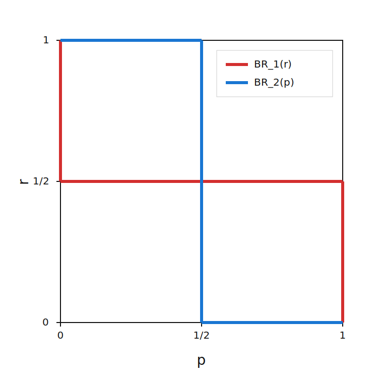

# SMU H3 Map

* Content map: [SMU H3 Game Theory Map](/posts/syllabus/smu-h3-study-map/)

---

# Bar Scene (A Beautiful Mind)
## Setup
* Simultaneous choice game
* $ n $ men and $ n + 1 $ women
* There is $ 1 $ blonde and $ n $ brunettes

## Payoffs
* Let the payoffs be:
  * $ a $ is for the player that chooses **blonde**
  * $ b $ is for the player that chooses **brunette** when the **blonde is not matched with anyone**
  * $ c $ is for the player that chooses **brunette** when the **blonde is matched**
  * $ d $ is for the player when there are **at least 2 players choosing blonde**

## Nash Equilibria (Pure Strategy)
$$
(\text{blonde}, \text{brunette}, \text{brunette}, \text{brunette})
$$

* No player can choose another option which have a better payoff
* No other player can choose blonde since everyone would get a payoff of $ d $
* The payoff is $ (a, c, c, c) $
* This applies for all permutations of $ n $

## Nash Equilibria (Mixed Strategy)

$$ \text{let } a = 3, \space b = 2,  \space c = 1,  \space d = 0 $$

$$
\text{let } p \text{ denote the probability that a player chooses blonde}
$$

$$
\text{let } 1-p \text{ denote the probability that a player chooses brunette}
$$

* We want to find a symmetric mixed strategy Nash equilibrium where all players adopt the same randomisation $ (p, \space 1-p) $

* From the point of view of P1

### For Blondes
$$
(\pi_1)_\text{blonde}
\begin{cases}
3 \quad &\text{ if nobody chooses blonde} \\
0 \quad &\text{ if one or more chooses blonde} 
\end{cases}
$$

$$
P(\text{no blonde}) = (1-p)^{n-1} \\
P(\text{at least one blonde}) = 1 - P(\text{no blonde})
$$

$$
\mathbb{E}(\pi_1)_\text{blonde} = 3 \cdot (1-p)^{n-1} + 0 \cdot (1-(1-p)^{n-1}) \\
\mathbb{E}(\pi_1)_\text{blonde} = 3(1-p)^{n-1}
$$

### For Brunettes
$$
(\pi_1)_\text{brunette}
\begin{cases}
1 \quad &\text{ if one chooses blonde} \\
2 \quad &\text{ if nobody or more than 1 choose blonde} 
\end{cases}
$$

$$
P(\text{one chooses blonde}) = p(n-1)(1-p)^{n-2} \\
P(\text{nobody or more than one blonde}) = 1 - P(\text{one chooses blonde})
$$

$$
\mathbb{E}(\pi_1)_\text{brunette} = 1 \cdot p(n-1)(1-p)^{n-2} + 2 \cdot (1-p(n-1)(1-p)^{n-2}) \\
\mathbb{E}(\pi_1)_\text{brunette} = 2 - p(n-1)(1-p)^{n-2}
$$

### Mixed Strategy Equilibrium
* For the mixed strategy equilibrium to exist, we apply product rule
* Thus, $ p $ must satisfy
$$
3(1-p)^{n-1} = 2 - p(n-1)(1-p)^{n-2}
$$

$$
(1-p)^{n-2}(3 - 3p + p(n-1)) = 2
$$

$$
(1-p)^{n-2}(3 + p(n-4)) = 2
$$

#### Cases
$$
\text{sub } n = 2: \\
$$

$$
3 - 2p = 2
$$

$$
p = \frac{1}{2}
$$

#### General Proof
* Prove that $ 0 < p < 1 $ 
* Given that $ n > 1, \space n \in \mathbb{Z}^+ $ 

$$
\text{let } f(p) = (1-p)^{n-2}(3 + p(n-4)) 
$$

$$
f(0) = (1-0)^{n-2}(3 + 0(n-4)) = 3
$$

$$
f(1) = (1-1)^{n-2}(3 + 1(n-4)) = 0
$$

$$
\text{thus, there lies a solution where }
$$
$$
f(p) = 2 \quad \text{for } n \ge 2, \space n \in \mathbb{R}
$$

---

# Probability
## Definition
* Probability measures the likelihood that an event or set of events occur(s)
* This can also be represented as the frequency by which such an event has occurred over a large number of observations

## Example
* Consider an experiment that generates the outcomes $ x_1, x_2, ..., x_n $
* Each of the outcomes have the associated probabilities $ p_1, p_2, ..., p_n $
* Where:
  * $ 0 \le p_i \le 1 \quad \text{s.t. } i \in \{1, 2, ..., n \}$
  * $ \sum^{n}_{i=1} p_i = 1 $

* We define the expected payoff (or weighted average) of the experiment is defined as:
$$
\mathbb{E}(x) = \sum_{i=1}^{n} p_i x_i = p_1 x_1 + p_2 x_2 + ... + p_n x_n 
$$

* We allow the players to choose at random (commit to a random device)
* Each player wants to find $ \max \mathbb{E}(x) $ for themselves

## Law of Large Numbers
* The **Law of Large Numbers** states that as the number of independent, identical trials increases, the sample average of results converges closer to the expected theoretical mean.

## Rules
* We will make extensive usage of the rules in probabiility theory

### Product Rule
#### Definition
$$
P(A) = \prod^{k}_{i=1} A_i = A_1 \cdot A_2 \cdot ... \cdot A_k
$$

* Divide a set of events $ A $ into finite subsets $ A_1, A_2, A_3, ..., A_k $
* Given that each subset of event is independent from one another
* The probability of the set of events is the product of the probability of its constituent events

#### Example
* For a coin with two sides (heads vs. tails)
* The probability of any possible outcome after flipping the coin three times $ A $ is given by:

$$
P(A) = \frac{1}{2} \cdot \frac{1}{2} \cdot \frac{1}{2} = \frac{1}{8}
$$

* Thus, this produces $ 8 $ possible outcomes, which can be represented in the form of 

$$
\frac{\text{no. times A occurs}}{\text{total no. of outcomes}}
$$

### Summation Rule
#### Definition
* If an event can happen through several **mutually exclusive** cases, its total probability is the sum of the probabilities of those cases.
* For mutually exclusive events $ A_1, A_2, ..., A_k $:
$$
P(A_1 \cup A_2 \cup ... \cup A_k) = P(A_1) + P(A_2) + ... + P(A_k)
$$

#### Example
* Suppose I roll a dice twice, keeping track of the dots at the top of the dice
* What is the probability that I obtain a sum of $ 5 $ across both rolls

| Roll 1 | Roll 2 | Probability |
| --- | --- | --- |
| 1 | 4 | $ \frac{1}{6}^2 = \frac{1}{36} $ |
| 2 | 3 | $ \frac{1}{6}^2 = \frac{1}{36} $ |
| 3 | 2 | $ \frac{1}{6}^2 = \frac{1}{36} $ |
| 4 | 1 | $ \frac{1}{6}^2 = \frac{1}{36} $ |

* The total probability of obtaining a sum of 5 is
$$
P(\text{sum}=5) = \frac{1}{36} + \frac{1}{36} + \frac{1}{36} + \frac{1}{36} = \frac{4}{36} = \frac{1}{9}
$$

## Conditional Probability
* Given two events $ A $ and $ B $, the probability that $ A $ happens given $ B $ is given by:
$$
P(A \mid B) = \frac{P(A \cap B)}{P(B)}, \quad P(B) > 0
$$

---

# Types of Strategies
## Pure Strategies
* Choosing one specific action with **probability 1**
* There is **no randomisation**: the same action is played whenever that information set is reached
* In matrix games, a pure strategy corresponds to selecting one row (for Player 1) or one column (for Player 2)

## Mixed Strategies
* A **probability distribution** over pure strategies
* The player **randomises** between actions (for example, choose action $ A $ with probability $ p $ and action $ B $ with probability $ 1-p $)
* Mixed strategies are often used when **no stable pure-strategy best response exists**

### Degenerate vs Non-degenerate Probability Distributions
* A **degenerate** distribution puts probability 1 on a single action and 0 on all others
* A **non-degenerate** distribution puts positive probability on at least two actions
* A pure strategy can be viewed as a **degenerate mixed strategy**

## Difference Between Pure and Mixed Strategies
* **Randomisation**: pure strategies use no randomisation; mixed strategies require randomisation
* **Representation**: pure strategies are single actions; mixed strategies are probability distributions over actions
* **Use case**: pure strategies are enough when a stable deterministic choice exists; mixed strategies are useful to keep opponents indifferent and prevent being predictable

## Nash Equilibria for Pure and Mixed Strategies
* The definition of Nash equilibria does not change
* With mixed strategies, 2 properties arise:

### 1. In a mixed strategy equilibrium, the player must be indifferent between all the pure strategies in the mixing bunch

### 2. In a mixed strategy equilibrium, the pure strategy that is *not* in the mixing bunch cannot give a better expected payoff

## Why have mixed strategies?
* Sometimes players want to be unpredictable, so opponents cannot exploit a fixed pattern.
* In some games, there is no pure-strategy Nash equilibrium; allowing randomisation gives an equilibrium in mixed strategies.
* Mixing can make the opponent indifferent between their actions, which is a key condition in mixed-strategy equilibrium.
* Real-world interpretation: players can use a random device (coin flip, dice, algorithm) to commit to probabilities.

# Chicken Game 
## Game 1
### Setup
* Options: Go straight or swerve
* Let $ P(\text{straight}) = p $ denote the probability of going straight and $ P(\text{swerve}) = 1-p $
* Mixed strategy can be $(p, \space 1-p)$
* Pure strategies are $(0, 1)$ and $(1, 0)$

| P2 \ P1 | Swerve | Straight |
|:-:|:-:|:-:|
|  **Swerve**  | 1, 1 |  0,  2 |
| **Straight** | 2, 0 | -1, -1 |

* For P1, $ P(\text{straight}) = r $ and $ P(\text{swerve}) = 1-r $
* For P2, $ P(\text{straight}) = p $ and $ P(\text{swerve}) = 1-p $

### Equilibrium
$$
\mathbb{E}(\pi_1)_\text{straight} = -1 \cdot p + 2 \cdot (1-p) = 2 - 3p \\
\mathbb{E}(\pi_1)_\text{swerve} = 1 \cdot p + 0 \cdot (1-p) = p
$$

$$
\mathbb{E}(\pi_2)_\text{straight} = -1 \cdot r + 2 \cdot (1-r) = 2 - 3r \\
\mathbb{E}(\pi_2)_\text{swerve} = 1 \cdot r + 0 \cdot (1-r) = r
$$

* By the **indifference condition**,
$$
\mathbb{E}(\pi_1)_\text{straight} = \mathbb{E}(\pi_1)_\text{swerve}
$$

$$
2-3p = p \\
p = \frac{1}{2}
$$

* Since game is symmetrical,
$$
\therefore p = r = \frac{1}{2}
$$

* The mixed strategy Nash equilibrium is $ \{(\frac{1}{2}, \frac{1}{2}), (\frac{1}{2}, \frac{1}{2})\} $

## Game 2
### Setup
* Options: Go straight or swerve
* Let $ P(\text{straight}) = p $ denote the probability of going straight and $ P(\text{swerve}) = 1-p $
* Mixed strategy can be $(p, \space 1-p)$
* Pure strategies are $(0, 1)$ and $(1, 0)$

| P2 \ P1 | Swerve | Straight |
|:-:|:-:|:-:|
|  **Swerve**  | 1, 1 |  0,  2 |
| **Straight** | 2, 0 | -1, -1 |

* For P1, $ P(\text{straight}) = r $ and $ P(\text{swerve}) = 1-r $
* For P2, $ P(\text{straight}) = p $ and $ P(\text{swerve}) = 1-p $

### Best Response Analysis

* Payoffs of P1

| Outcomes | Payoffs |
| --- | --- | 
| -1 | $ p \cdot r $ |
| 2 | $  p \cdot (1-r) $ |
| 1 | $ (1-p) \cdot r $ |
| 0 | $ (1-p) \cdot (1-r) $ |

$$
\mathbb{E}(\pi_1) = p\big[ -r + 2(1-r) \big] + (1-p) \big[ r + 0(1-r)\big]
$$

$$
\mathbb{E}(\pi_1) = p \cdot \mathbb{E}(\pi_1)_\text{straight} + (1-p) \cdot \mathbb{E}(\pi_1)_\text{swerve}
$$

$$
\therefore \mathbb{E}(\pi_1) = \mathbb{E}(\pi_1)_\text{swerve} + p \bigg[\mathbb{E}(\pi_1)_\text{straight} - \mathbb{E}(\pi_1)_\text{swerve} \bigg]
$$

$$
\text{let } \Delta_1 = \mathbb{E}(\pi_1)_\text{straight} - \mathbb{E}(\pi_1)_\text{swerve}:
$$

$$
\begin{cases}
\mathbb{E}(\pi_1) \text{ is straight line with positive slope} &\text{if } \Delta_1 > 0 \\
\mathbb{E}(\pi_1) \text{ is straight line with negative slope} &\text{if } \Delta_1 < 0 \\
\mathbb{E}(\pi_1) \text{ is straight horizontal line} &\text{if } \Delta_1 = 0
\end{cases}
$$

$$
\Delta_1 = 2 - 3r - r = 2 - 4r \\
r = \frac{1}{2}
$$

$$
BR_1(r) = 
\begin{cases}
1 \space &\text{if } r < \frac{1}{2} \\
0 \space &\text{if } r > \frac{1}{2} \\
[0, 1] \space &\text{if } r = \frac{1}{2}
\end{cases}
$$

### Homework
$$
BR_2(p) = 
\begin{cases}
1 \space &\text{if } p < \frac{1}{2} \\
0 \space &\text{if } p > \frac{1}{2} \\
[0, 1] \space &\text{if } p = \frac{1}{2}
\end{cases}
$$
* Find $ BR_2(p) $ for P2 using the steps from before

### Graph 

* You identify three Nash equilibrium points: 
1. $(\{1, 0\}, \{0, 1\})$ -> (Straight, Swerve)
2. $(\{0, 1\}, \{1, 0\})$ -> (Swerve, Straight)
3. $(\{\frac{1}{2}, \frac{1}{2}\}, \{\frac{1}{2}, \frac{1}{2}\})$

## Game 3
### Setup
* 2 Players
* 3 Strategies
* Fully mixed Nash equilibrium -> All options are in the mixing the mixing bunch
* Partially mixed Nash equilibrium -> 2 or 3 strategies are in the mixing bunch

* Payoff matrix

| P2 \ P1 | A | B | C |
| --- | --- | --- | --- | 
| A | 1, 1 | 1, 0 | 0, 0 |
| B | 0, 1 | 2, 2 | 1, 0 |
| C | 0, 0 | 0, 1 | 3, 3 |

### Pure Strategy Nash Equilibra
* It is obvious, the Pure Strategy Nash Equilibra are: 
  * (A, A)
  * (B, B)
  * (C, C)

### Fully Mixed Nash Equilibria
* Players must be indifferent (Property 1)

* For P1: 
  * $ P(A) = p $
  * $ P(B) = q $
  * $ P(C) = 1 - p - q $
* For P2: 
  * $ P(A) = r $
  * $ P(B) = s $
  * $ P(C) = 1 - r - s $

#### Player 1

$$
\mathbb{E}(\pi_1)_A = r + s \\
\mathbb{E}(\pi_1)_B = 2s + 1-r-s = 1+s-r \\
\mathbb{E}(\pi_1)_C = 3(1-r-s) 
$$

* Impose condition 1
$$
\mathbb{E}(\pi_1)_A = \mathbb{E}(\pi_1)_B \\
r + s = 1 + s - r \\
\therefore r = \frac{1}{2}
$$

$$
\mathbb{E}(\pi_1)_A = \mathbb{E}(\pi_1)_C \\
r + s = 3 - 3(r+s) \\
4r + 4s = 3 \\
2 + 4s = 3 \\ 
\therefore s = \frac{1}{4}
$$

* P1 is indifferent between A, B and C
* This occurs whenever P2 adopts the mixing bunch $(\frac{1}{2}, \frac{1}{4}, \frac{1}{4})$
* P2 will adopt it when P2 is different

### Partially Mixed Nash Equilibria
* P1 mixes A and B
* P2 mixes A and B

* P1 is indifferent between A and B and does not prefer C
* This is given that P2 adopts the mixing bunch $ (r, 1-r, 0) $

* From before,
$$
\mathbb{E}(\pi_1)_A = r + s \\
\mathbb{E}(\pi_1)_B = 1 + s - r \\
\mathbb{E}(\pi_1)_C = 3(1 - r - s) 
$$

* Now set $ r + s = 1 $
$$
\mathbb{E}(\pi_1)_A = 1 \\
\mathbb{E}(\pi_1)_B = 2(1 - r) \\
\mathbb{E}(\pi_1)_C = 0
$$

* Imposing condition 1
$$
\mathbb{E}(\pi_1)_A = \mathbb{E}(\pi_1)_B \\
1 = 2(1 - r) \\
r = \frac{1}{2}, \space s = \frac{1}{2}
$$

* Testing condition 2
$$
\mathbb{E}(\pi_1)_C = 3(1 - r - s) = 3(1 - \frac{1}{2} - \frac{1}{2}) = 0
$$

* Both conditions hold when P2 adopts the mixing bunch $(\frac{1}{2}, \frac{1}{2}, 0)$