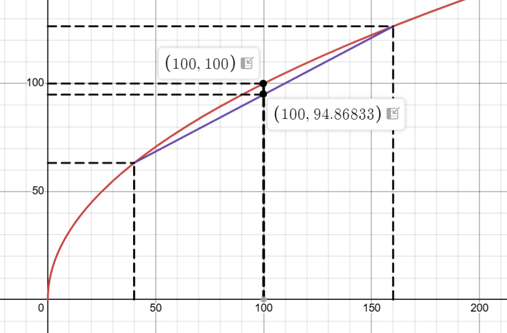

# SMU H3 Map

* Content map: [SMU H3 Game Theory Map](/posts/syllabus/smu-h3-study-map/)

---

# Tit-for-Tat for the Infinite Game
## Definition
* Strategy copies the behaviour from $ t - 1 $ for the game at timestep $ t $
* 4 classes of subgames matter
  * $ (C, C) $
  * $ (C, D) \rightarrow (D, C) $
  * $ (D, C) \rightarrow (C, D) $
  * $ (D, D) $

## Payoffs
### Subgame 1
$$
V(C, C) = 4 + \delta V(C, C)
$$

$$
V(C, C) = \frac{4}{1 - \delta}
$$

### Subgame 2
$$
V(D, D) = a + \delta V(D, D)
$$

$$
V(D, D) = \frac{a}{1 - \delta}
$$

### Subgame 3
$$
V(C, D) = 6 + \delta V(D, C)
$$

$$
V(C, D) = 6 + \delta(-2 + \delta V(C, D))
$$

$$
V(C, D) = 6 + -2 \delta + \delta^2 V(C, D)
$$

$$
V(C, D) = \frac{6 - 2 \delta}{1 - \delta^2}
$$

### Subgame 4
$$
V(D, C) = -2 + \delta V(C, D)
$$

$$
V(D, C) = -2 + \delta (6 + \delta V(D, C))
$$

$$
V(D, C) = -2 + 6\delta + \delta^2 V(D, C)
$$

$$
V(D, C) = \frac{6\delta - 2}{1 - \delta^2}
$$

## Answer
### Subgame 1
* We are in the subgame after observing $ (C, C) $
* $ V(C, C) = 4 + \delta V(C, C) $ if no deviation
* $ V(\text{one-shot deviation}) = 6 + v(D, C) $ if deviation
* To deviate, we need
$$
V(C, C) \ge 6 + \delta V(D, C)
$$

### Subgame 2

### Subgame 3

### Subgame 4
* $ V(D, D) = a + \delta V(D, D) $ if no deviation
* $ V(\text{one-shot deviation}) = -2 + V(C, D) $ if deviation
* To deviate, we need
$$
V(D, D) \ge -2 + \delta V(C, D)
$$

# Carrot Game
## Rules
* Two players with one box each
* One player looks into the box to see if he has a carrot or not
* The other player has to decide whether to swap boxes or keep the box that he was given
* The objective of the game is to receive the carrot
* There is imperfect information since only one player knows where the winning condition is 

# External Uncertainty
## Definition
* Random events that are **beyond the control** of the single decision maker
* **Who** then takes them as given and acts in order to maximise his or her expected payoff
* Agents may **not like taking risk** (*risk aversion*) and so they **look for solutions** to protect themselves against it

## Risk Sharing
* If things go well for me, they go bad for you and vice versa

### Agreement 1

| Outcome | Good | Bad |
| ------- | ------- | ------ |
| Results | 160,000 | 40,000 |
| Probability | 0.5 | 0.5 |

$$
\mathbb E (\pi) = 100000
$$

### Agreement 2

* If an agreement is made such that the lucky one pays 60000 to the unlucky one

| Outcome | Good | Bad |
| ------- | ------- | ------ |
| Results | 100,000 | 100,000 |
| Probability | 0.5 | 0.5 |

* Risk sharing occurs when you have a definite outcome of the expected payoff on average without incurring risk

### Risk-Aversion
* A risk-averse agent minimises uncertainty even when the expected payoff is the same

## Formalising Risk-Aversion
* Suppose that we value the amount of $ x $ at $ \sqrt x $
* Expected payoff from being payoff-dominant is
$$
\mathbb E(u) = \frac{1}{2} \sqrt{160000} + \frac{1}{2} \sqrt{40000} = 300
$$

* Expected payoff from the risk-dominant agreement is
$$
\mathbb E(u) = \frac{1}{2} \sqrt{100000} + \frac{1}{2} \sqrt{100000} = 100\sqrt{10} > 300
$$

## Insurance
### Definition
* Insurance companies take some risk in exchange of cash
* Going back to the example, if I had 90,000 in each state, I would be getting the same expected payoff of 300
* Since by being subject to risk, on average I have 100,000 
* I can conclude that 10,000 is the maximum price I am willing to pay (to the insurance company) to forgo risk

# Strategic Information Transmission
## Definition
* The extent to which the informed party **wants to reveal  the information** is a matter of **strategic considerations**
* The informed party should decide to reveal what is in his best interest to reveal
* The uninformed party is aware of this fact

## Cheap Talk
### Definition
* The easiest way to transmit information is by  communicating it
* When this does not cost anything to the player, we say we are in the context of Cheap Talk games
* Cheap Talk games add one round of pre-play communication to the game

### Insights
* If the interests in the game are aligned, pre-play  communication may help solving coordination problems
* However there are other sub-game perfect equilibria in which the pre-play communication is ignored (babbling equilibria)

### Rules
* Player 1 announces his choice
* Both players maker their choices after the announcement
* Cheap Talk **works** in this case:
    * Player 1 says “Local Latte” and then chooses to do whatever he has said at the pre-play communication
    * Player 2 chooses to go wherever Player 1 said he was going
* Cheap Talk **does not work** in this case:
    * Player 1 says “Local Latte” and then chooses Starbucks no matter his announcement
    * Player 2 chooses Starbucks no matter what Player 1 has said

| | Starbucks | Local Latte |
| --- | --- | --- |
| Starbucks | $1,1$ | $0,0$ |
| Local Latte | $0,0$ | $2,2$ |

### Zero-Sum Games
* Cheap Talk does not work in zero sum games
* In other words, when the interests between the two players are in total conflict, cheap talk does not work

## Lemon Market

### Example 1
* If the value of a used car can be either $ 0 $ or $ 10 $
    * If the seller offers $0$, buy since the expected payoff is $ 0 $
    * If the seller offers $ P > 0 $, do not buy since the seller will sell the car worth $0$, meaning that the expected payoff is $ -P $

* The seller who knows the value of the used car accepts an offer to buy that car at the average price $ 5 $

### Example 2
* Suppose the value of the car is $ q $ for the seller 
* Suppose the buyer is willing to pay $ 1.5 q $ for the car (but he does not know $ q $)

#### Illustration
* When you pay $ 10 $, the average value of the car is $ \frac{0+10}{2} = 5 $
* To the buyer, the value of the car is $ 1.5 \cdot 5 = 7.5 $
* You lose on average, since $ 10 > 7.5 $ 

# Signalling
* Informed parties can credibly convey information to the
uninformed party if this is convenient to them
* Signalling is a strategy used to resolve asymmetric information, where one player has information that the other player lacks

## Education Game
### Setup
* Student $ A $ and Student $ C $
* They take courses at school:
    * Type $ A $ can take hard courses at $ \$ 3000 $
    * Type $ C $ can take hard courses at $ \$ 14000 $
* Employers value workers 
    * Type $ A $ at $ \$ 160000 $
    * Type $ C $ at $ \$ 60000 $

### Signalling Function
* Type $ A $ may find it worthwhile signalling their type by taking enough hard courses $ n $ that type $ C $ students do not want to take
* The signal works if it cannot be faked, that is:
    * Type $ A $ students prefer to take $ n $ hard courses (rather than deviating to choose $ 0 $ courses)
    * Type $ C $ students prefer to take $ 0 $ hard courses (rather than deviating to choose $ n $ courses)

### Incentive Compatibility
* $ n $ must satisfy the following inequalities
* **Upper bound**
$$
160,000 - 3,000n \ge 60,000 \\
n \le {100 \over 3}
$$
* **Lower bound**
$$
60,000 \ge 160,000 - 14,000n \\
n \le {100 \over 14}
$$

* This means that there is no gains from deviating in strategy, meaning that the student is indifferent 

$$
\therefore 7.14 \le n \le 33.33
$$

$$
8 \le n \le 33
$$

### Individual / Participation Rationality
* Suppose type $ A $ students can secure at least $ \$125,000 $
* Suppose type $ C $ students can secure at least $ \$30,000 $

* Type $ C $ is always incentivised to participate ($ \$ 60000 > \$30000 $)

* Type $ A $ is only incentivised to signal such that 

$$
160000 - 3000n \ge 125000
$$

$$
n \le {35 \over 3} \approx 11
$$

* Thus, $ 8 \le n \le 11 $

### Pooling Equilibrium
*  A separation may not be the only possible outcome
* Pooling of types may occur as well, in which case both $A$ and $C$ students earn the same wage, and none of them take hard course while in college
* The common wage is the expected value from hiring an A or a C student, that is 
$$
160,000p + 60,000(1-p) = 100,000p + 60,000
$$

* While a $C$ student prefers pooling from separation, an $A$ student does not
* So this type may have an incentive to deviate and take just one hard course
* We need that employers understand that the deviation comes from the $A$ student
$$
160,000 - 3,000 > 100,000p + 60,000
$$
* Thus, deviations are not profitable and pooling equilibrium occurs when 
$$
160,000 - 3,000 \le 100,000p + 60,000
$$

$$
p \ge 0.97
$$

* We need $ p $ large enough for pooling equilibrium to arise in this context