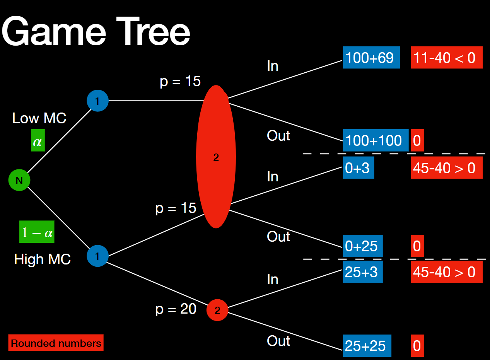
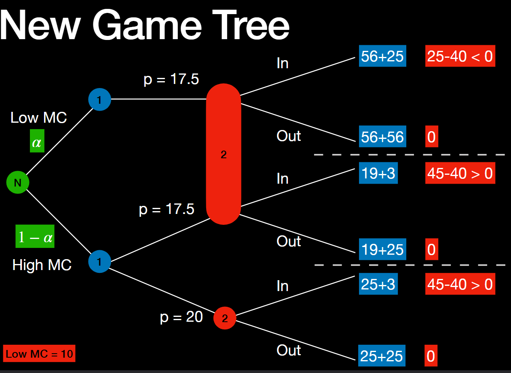
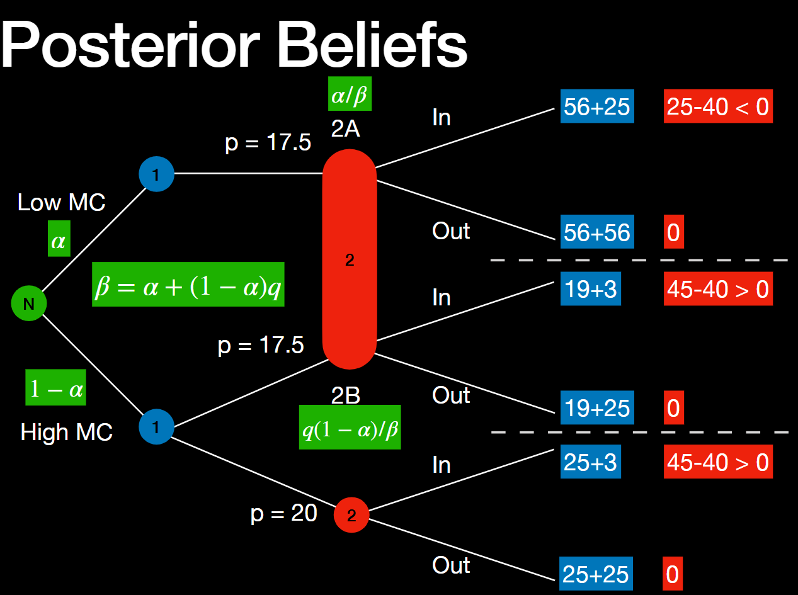

# SMU H3 Map

* Content map: [SMU H3 Game Theory Map](/posts/syllabus/smu-h3-study-map/)

---

# Games of Incomplete Information
## Nature
* Nature (chance) selects the ingredients of the game at random
* Players have common knowledge of the structure
* It becomes a game of imperfect information where players may know some of nature's moves
* Nature has no stake in the game, so random choices are made in a non-strategic manner

## Strategies
* Strategies will depend on the information about nature's moves an  choices available to players
* Equilibrium concept stays the same but players will have to form beliefs about the other players' informatino in oder to find the best plan of action
* These beliefs must be consistent with those players' choices (whenever possible) 

# Trade Wallet Game
## Rules
* Nature draws $ W_1 $ and $ W_2 $ (wallets for P1 and P2 respectively)
* This is done independently from the set $ \mathcal{W} $ with equal probability such that

$$
\mathcal{W} = \{5, 6, 7, ..., 55\}
$$

* P1 knows $ W_1 $, P2 knows $ W_2 $, and both players know about the wy nature moves

## Strategies
* Strategies are the rules that maps the (keep, swap) decision for any possible amount in one's wallet

$$
\{5, 6, 7, 8, 9, 10, ..., 55\}
$$ 

$$
\{k, k, s, s, s, s, ..., k\}
$$

* There are $ 2^{51} $ strategies
* The equilibrium is the pair of strategies $ (\sigma_1, \sigma_2) $ that are the mutual best responses

## Iterative Deletion
### For $ W=55 $
* If the player keeps, he receives $ \pi = 55 $
* If the player swaps, he receives $ \pi < 55 $
* Strategies where player swaps are weakly dominated by strategies by player keeps where $ W=55 $

### For $ W=54 $ 
* If the player keeps, he receives $ \pi = 54 $
* If the player swaps, he receives $ \pi \le 54 $
* Strategies where player swaps are weakly dominated by strategies by player keeps where $ W=54 $

### For $ W=5 $
* If the player keeps, he receive $ \pi=5 $ 
* If the player swaps, he receives $ \pi=5 $

## Equilibrium #1
* Let the strategies $ (\sigma_1, \sigma_2) $ be defined as follows
  * $ \sigma_1 $: Swap when $ W $ = 5, keep otherwise
  * $ \sigma_2 $: Keep always

* $ (\sigma_2, \sigma_2) $ is an equilibrium

* Suppose P2 adopts $ \sigma_2 $, what is the expected payoff for P1 if he adopts $ \sigma_1 $?

| $ W_1 $ | Choice | Outcome |
| --- | --- | --- |
| 5 | SWAP | Trade if $ W_2=5$ , No Trade if $ W_2 > 5 $ |
| 6 | KEEP | No Trade |
| 7 | KEEP | No Trade |
| ... | ... | ... |
| 55 | KEEP | No Trade |

* P1 with $ W_1 > 5 $ has the same payoff from  $ \sigma_1 $ and $ \sigma_2 $, meaning no gain from deviating
* When $ W_1 = 5 $ under $ \sigma_2 $, there are two possible outcomes
  * $ W_2 = 5 $, then the trade results in $ \pi_1 = \pi_2 = 5 $
  * $ W_2 > 5 $, then the trade results $ \pi_1 = 5 $

## Homework
* Verify that the following strategies are equilibria:
    * $(\sigma_1, \sigma_1)$
    * $(\sigma_1, \sigma_2)$
    * $(\sigma_2, \sigma_1)$

## Behaviour Reveals Information
* Suppose P2 adopts the following strategy
$$
\hat \sigma_2 = 
\begin{cases}
\text{KEEP} \space &\text{if } W_2 \ge C_2 \\
\text{SWAP} \space &\text{if } W_2 < C_2 \\
\end{cases}
$$

* $ C_2 $ is the cutoff, where $ C_2 = 27 $

* P1's best response is as follows if P1 chooses SWAP

| $ W_2 $ | Outcome | Payoff | Probability
| --- | --- | --- | --- |  
| 5 | Trade | 5 | $ \frac{1}{51} $ |
| 6 | Trade | 6 | $ \frac{1}{51} $ |
| ...  | ... | 
| 26 | Trade | 26  | $ \frac{1}{51} $ |
| 27 | No Trade | $W_1$ | $ \frac{1}{51} $ |
| 28 | No Trade | $W_1$ | $ \frac{1}{51} $ |
| ... | ... |
| 55 | No Trade | $W_1$ | $ \frac{1}{51} $ |

* Expected payoff if P1 chooses swap with $ W_1 $
$$
\mathbb{E}(\pi)_1 = \frac{5+6+7+...+26}{51} + \frac{29W_1}{51}
$$

* Expected payoff if P1 chooses keep with $ W_1 $
$$
\mathbb{E}(\pi)_2 = \frac{22W_1}{51} + \frac{29W_1}{51}
$$

* Thus, P1 chooses keep is better whenever
$$
\frac{22W_1}{51} \ge \frac{5+6+7+...+26}{51}
$$

$$
W_1 \ge \frac{5+6+7+...+26}{22}
$$

$$
\therefore W_1 \ge 15.5
$$

* This reveals that $ \mathbb{E}(W_2) = 15.5 $, since it is expected that $ W_2 \sim U(5, 26) $

* Thus, P1's best response is

$$
\hat \sigma_1 = 
\begin{cases}
\text{KEEP} \space &\text{if } W_1 \ge C_1 \\
\text{SWAP} \space &\text{if } W_1 < C_1 \\
\end{cases}
$$

* $ C_1 $ is the cutoff, where $ C_1 = 15.5 $

## Equilbrium #2
* An equilibrium, therefore, will be in cutoff rules
$$
\hat \sigma_1 = 
\begin{cases}
\text{KEEP} \space &\text{if } W_1 \ge C_1 \\
\text{SWAP} \space &\text{if } W_1 < C_1 \\
\end{cases}
$$

$$
\hat \sigma_2 = 
\begin{cases}
\text{KEEP} \space &\text{if } W_1 \ge C_2 \\
\text{SWAP} \space &\text{if } W_1 < C_2 \\
\end{cases}
$$

* In an equilibrium, 
  * $ \hat \sigma_1 $ is BR to $ \hat \sigma_2 $
  * $ \hat \sigma_2 $ is BR to $ \hat \sigma_1 $

* The best cutoffs are thus
  * (1) : $ C_1 = \frac{5 + C_2}{2} $ 
  * (2) : $ C_2 = \frac{5 + C_1}{2} $

* (1) and (2) must hold simultaneously
  * $ 2C_1 - C_2 = 5 \text{ and } 2C_2 - C_1 = 5 $
  * $ 2C_1 - C_2 = 2C_2 - C_1 $
  * $ \therefore C_1 = C_2 = 5 $

* Thus, the equilibrium strategy is to not swap

# Types of Signalling Equilibria

### Pooling Equilibrium
* **Action**: All Sender types choose the **same action**.
* **Information**: The Receiver gains **no new information**; the signal is "noise."
* **Requirement**: Rewards for mimicking are high, or the signal cost is too low to be restrictive.
* **Result**: The Receiver must rely on **prior beliefs** to make a decision.
* **Example**: If a certification is granted without a rigorous audit, both safe and dangerous firms will display it.

## Separating Equilibrium
* **Action**: Different Sender types choose **distinct, different actions**.
* **Information**: The Receiver gains **perfect information**; the signal acts as a clear "label."
* **Requirement**: Signal cost is high enough to deter low-quality types ($Cost_{Low} > Benefit > Cost_{High}$).
* **Result**: The Receiver becomes **certain** of the Sender's true identity or quality.
* **Example**: Only high-ability students can finish a grueling PhD; the degree perfectly signals ability to employers.

## Semi-Separating (Hybrid) Equilibrium
* **Action**: One type always signals; the other type **randomises (bluffs)** their move.
* **Information**: The Receiver gains **partial information**; they update their probability but remain uncertain.
* **Requirement**: Payoffs make the low-type **indifferent** between mimicking the high-type or revealing themselves.
* **Result**: A state of **refined guessing** where the signal makes a specific type more likely but not guaranteed.
* **Example**: A poker player with a weak hand bluffs only occasionally to keep the opponent from knowing if a bet indicates strength.

# Signalling Games
## Setup
* Incumbent firms can have 
  * $ MC = 5 $ with probability $ \alpha $ 
  * $ MC = 15 $ with probability $ 1 - \alpha $
* Entrant firms have $ MC=10 $ and $ FC=40$
* Demand curve is $ P = 25 - Q $ 

## Stages
* **Stage 1**: Incumbent sets the monopolist price of each type
* **Stage 2**: Entrant decides whether to enter upon observing the price charged by the incumbent
* If the entry occurs, the two firms play a quantity duopoly game

# Game Tree 1

## Separating Equilibrium
### Definition
* In a separating equilibrium, the Incumbent fully reveals the $ MC $ based on their action

### Strategy
* This is achieved via the strategy $(15 , 20)$
* Given the strategy, the Entrant understands that 15 can only come from a low $MC$ Incumbent and 20 can only come from a high $MC$ Incumbent
* The Incumbent has low $MC$ if the price is 15 and has high $MC$ if the price is 20
*  Therefore, the Entrant optimally chooses $(Out, In)$ given his (rational) beliefs about the Incumbent types

### Alternative
* The only other strategy is $(15, 15)$ so that the Entrant always stays out
* However the high $MC$ Incumbent earns lower profits by letting the Entrant out at a price of 15
* There are no profitable deviations and the proposed strategies and beliefs constitute a Separating Equilibrium

## Pooling Equilibrium
### Definition
* In a pooling equilibrium, the Incumbent adopts the same pricing regardless of the $ MC $

### Strategy
* The Incumbent firm adopts the pricing $(15, 15)$
* Given this strategy the Entrant cannot improve on his prior
knowledge about types
* The probability of a low $MC$ Incumbent remains at $ \alpha $

### Analysis
* If the Incumbent firm has a high $MC$,
  * Choosing $ p=15 $ will result in a payoff of 3 or 25
  * Choosing $ p=20 $ will result in a payoff of 28 or 50
  * $ p=15 $ is dominated by $ p=20$
* There is no pooling equilibrium

# Game Tree 2

## Separating Equilibrium
### Strategy
* There is no separating equilibrium
* There is an incentive to deviate from $ p=20 $ even when the Incumbent has high $ MC $

## Pooling Equilibrium
### Strategy
* There is a pooling equilibrium
* There is no incentive to deviate from $ p=17.5 $ 

### Analysis
* P1 chooses $ 17.5 $ when high $ MC $ and when low $ MC $
* P2's strategy is a choice: 
  * (In or Out) if $p=17.5$
  * (In or Out) if $p=20$

* Since P1 is coosing $(17.5, 17.5) \rightarrow (\text{high MC}, \text{low MC})$ 

#### Set 1
* P2 cannot use the information from that strategy to form beliefs about P1's type if $p=20$ is observed
* The game tree however suggests that only P1 and high $ MC $ can choose $p=20$
* Hence, the following probabilities are true:
  * $ P(\text{high MC } | \space p=20) = 1 $
  * $ P(\text{low MC } | \space p=20) = 0 $
* P2's best response to $ p=20 $ is In

#### Set 2
* If $p=17.5$ is observed, P2 does not learn anything that P2 already knew
* This is equivalent knowledge to
  * $ P(\text{high MC } | \space p=20) = 1-\alpha $
  * $ P(\text{low MC } | \space p=20) = \alpha $

* By choosing In
$$
\mathbb{E}(\pi) = \alpha(25-40) + (1-\alpha)(45-40) \\
\mathbb{E}(\pi) = 25\alpha + 45(1-\alpha) - 40 \\
\mathbb{E}(\pi) = 5 - 20\alpha \ge 0
$$

* However, the pooling equilibrium can only exist if the best response for P2 is Out
* We need the opposite inequality to hold
$$
-20\alpha + 5 \le 0 \\
\alpha \ge \frac{1}{4}
$$

### Conclusion
* $ \alpha \ge \frac{1}{4} $
* $ (17.5, 17.5) $ and $ (\text{OUT}, \text{IN}) $

$$
P(\text{low MC} \space | \space p) =
\begin{cases}
\alpha \space &\text{if } p=17.5 \\
0 \space &\text{if } p=20
\end{cases}
$$

## Semi-Separating Equilibrium

### Strategy
* For P1
  * P1 (low $MC$) chooses $p=17.5$ with probability $1$
  * P1 (high $MC$) chooses $p=17.5$ with probability $q$
* For Nature
  * Nature chooses P1 (low $MC$) with probability $q$
  * Nature chooses P1 (high $MC$) with probability $1-\alpha$

* Thus,
$$
P(2A) = \alpha \cdot 1 = \alpha \\
P(2B) = (1 - \alpha) \cdot q
$$

* $2A$ is favourable case if I ask what is $ P(2A \space | \space \{2A, 2B\}) $
* $2B$ is favourable case if I ask what is $ P(2B \space | \space \{2A, 2B\}) $

### Conclusion (Favourable cases / Possible cases)
$$
P(2A \space | \space \{2A, 2B\}) = \frac{\alpha \cdot 1}{\alpha \cdot 1 + (1 - \alpha) \cdot q}
$$