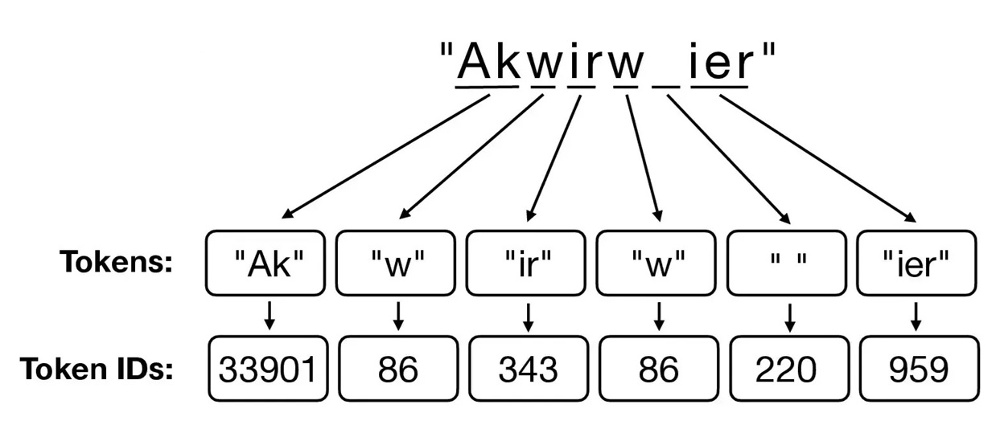
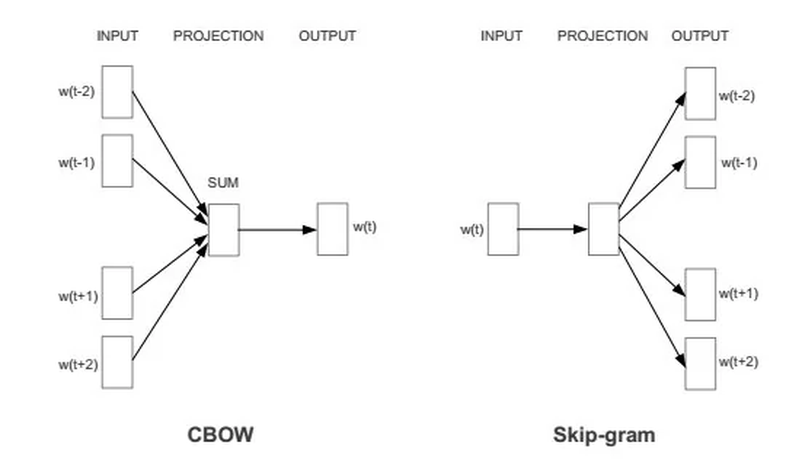
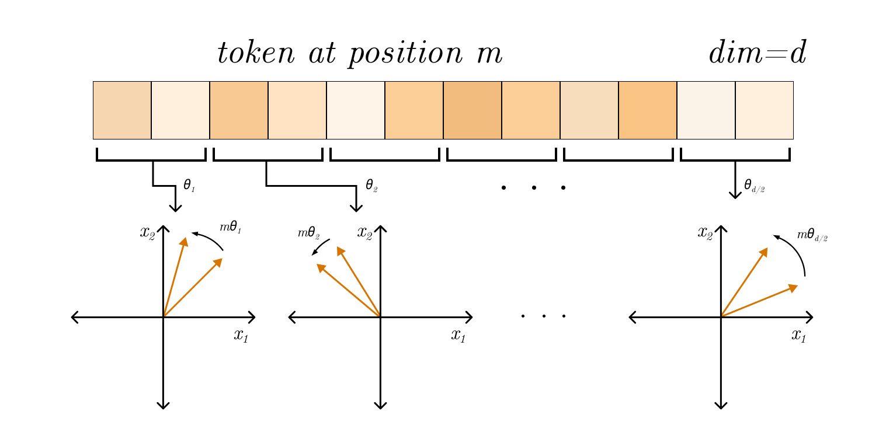

# Syllabus Map

* Study map: [Syllabus Study Map](/posts/syllabus/ioai-study-map/)

---

# Overview

* Embeddings map discrete or high-dimensional inputs into dense vectors that capture **similarity** and **structure**.
* Good embeddings make **downstream learning easier** by placing related items closer in vector space.
* This note summarises embeddings for **text, images, audio, and structured data**, plus practical tips.

---

# Core Idea

* An embedding is a learnable function $f(x) \rightarrow \mathbb{R}^d$.
* Similar inputs should have **nearby vectors** (cosine similarity or dot product).
* Embeddings are usually **trained jointly** with a task or via **self-supervision**.

---

# Sparse vs Dense Embeddings

## Sparse Embeddings

* Most dimensions are zero; only a small subset are non-zero.
* Common examples: one-hot vectors, bag-of-words, and TF-IDF.
* Usually high-dimensional, such as vocabulary-sized vectors.
* Easy to interpret because each dimension maps to a specific token/feature.

$$
x \in \mathbb{R}^V,\quad \|x\|_0 \ll V
$$

## Dense Embeddings

* Most dimensions contain non-zero values.
* Common examples: Word2Vec, GloVe, BERT token embeddings, CLIP embeddings.
* Usually lower-dimensional, such as $d=128$ to $d=4096$.
* Harder to interpret directly, but better at capturing semantic similarity.

$$
z = f(x),\quad z \in \mathbb{R}^d,\quad d \ll V
$$

## Key Tradeoffs

* **Interpretability**:
* Sparse vectors are more human-readable.
* Dense vectors are less interpretable but often more expressive.
* **Memory and compute**:
* Sparse vectors can be memory-heavy at very large vocab sizes.
* Dense vectors are compact and efficient for neural models.
* **Generalisation**:
* Sparse methods treat tokens as mostly independent.
* Dense methods share statistical strength across similar tokens/items.
* **Best use cases**:
* Sparse: classical IR/search baselines, small-data linear models.
* Dense: semantic search, transfer learning, deep learning pipelines.

## Practical Rule

* Start with sparse features (for example TF-IDF) for a fast baseline.
* Move to dense embeddings when you need semantic similarity, transfer, or multimodal alignment.

---

# Text Embeddings

## Tokenisation matters
* **Word-level**: simple but large vocab and OOV issues.
* **Subword** (BPE/WordPiece): handles OOV and morphology.
* **Character**: robust but longer sequences.

## Static vs Contextual
* **Static** (Word2Vec, GloVe, fastText): one vector per token.
* **Contextual** (BERT, GPT-style): token vector depends on surrounding words.

## Training objectives
* **Skip-gram / CBOW**: predict context words.
* **Masked language modelling**: predict masked tokens.
* **Contrastive**: pull positives together, push negatives apart.

## Practical notes
* For similarity, **cosine** is a strong default.
* Normalise embeddings if using dot products across batches.
* Mean-pooling of token vectors is a good baseline for sentence embeddings.

---

## BPE (Byte-Pair Encoding)

### Core Idea
* Start with characters, then repeatedly merge the most frequent adjacent pairs.
* **Why it works**: frequent word fragments become subwords, so rare words can be built from pieces.

### Steps
#### Step 1: Initialise the vocabulary
* Build an initial vocabulary of **characters** plus a word boundary marker.
* Represent each word as a sequence of characters.

#### Step 2: Count symbol pairs
* Scan the corpus and count all **adjacent symbol pairs**.
* Track the most frequent pairs across the full corpus.

#### Step 3: Merge the best pair
* Merge the **most frequent pair** into a new symbol.
* Add the new symbol to the vocabulary.

#### Step 4: Update the corpus
* Replace all occurrences of the merged pair.
* Recompute adjacent pairs on the updated corpus.

#### Step 5: Repeat until target size
* Loop steps 2–4 until you hit the vocabulary budget.
* Stop early if no merges are beneficial.

#### Step 6: Tokenise new text
* Apply the learned merges in order.
* Produce a sequence of subword tokens.

### Strengths and Weaknesses
* **Strengths**:
  * Controls vocabulary size.
  * Handles OOV by breaking into subwords.
* **Weaknesses**:
  * Not probabilistic; merges are frequency-based only.
  * Can split words in unintuitive ways (e.g., `im|port|ant`).
* **When to use**: strong default for modern NLP and LLM tokenisers.

## WordPiece

### Core Idea
* Like BPE but merges maximise **likelihood** of the training data.
* **Why it works**: likelihood-driven merges favour subwords that explain the corpus well, so frequent patterns become stable tokens while rare words still decompose cleanly.

### Steps
#### Step 1: Initialise the vocabulary
* Start with **characters** and word boundary markers.
* Represent each word as a sequence of characters.

#### Step 2: Score segmentations
* Train a simple language model to score candidate segmentations.
* Estimate likelihood for current token splits.

#### Step 3: Propose new subwords
* Consider adding candidate subwords.
* Measure **likelihood improvement** for each candidate.

#### Step 4: Add the best candidate
* Add the subword that yields the **largest likelihood gain**.
* Update the vocabulary.

#### Step 5: Re-tokenise the corpus
* Re-segment the corpus with the updated vocabulary.
* Recompute statistics for the next iteration.

#### Step 6: Repeat until target size
* Continue steps 2–5 until you hit the vocabulary budget.
* Stop early if gains are negligible.

#### Step 7: Tokenise new text
* Apply **longest-match-first** subword matching.
* Produce token sequences for the model.
 
### Strengths and Weaknesses
* **Strengths**:
  * Often yields more linguistically coherent subwords.
  * Common in BERT-family tokenisers.
* **Weaknesses**:
  * Training is a bit more complex than BPE.
* **When to use**: transformer models where stable, reusable tokenisers matter.

## TF-IDF
### Core Idea
* Sparse vector for a document based on word frequency scaled by rarity.
* **Why it works**: common words get down-weighted and informative, rare terms are emphasised, making documents easier to separate.

### Steps
#### Step 1: Build the vocabulary
* Extract terms from the corpus.
* Optionally remove stopwords or apply stemming.

#### Step 2: Compute term frequency
* For each document $d$, compute 
$$
\text{tf}(t, d) =
\begin{cases}
1 + \lg \text{count}(t, d) & \text{if } \text{count}(t, d) > 0 \\
0 & \text{otherwise}
\end{cases}
$$

* Use raw counts or log-scaled counts.
* **Term frequency (TF)**:
  * Captures how frequent a term is within a document.
  * Higher TF suggests the term is more informative about that document.

#### Step 3: Compute document frequency
* Count how many documents contain each term $t$.
* Store $\text{df}(t)$ for the full corpus.
* **Document frequency (DF)**:
  * $\text{df}(t)$ is the number of documents containing term $t$.
  * Rare terms (low $\text{df}$) help discriminate documents.

#### Step 4: Compute inverse document frequency
* $\text{idf}(t) = \log\frac{N}{\text{df}(t) + 1}$.
* Use smoothing to avoid division by zero.
* **Inverse document frequency (IDF)**:
  * Terms appearing in every document get weight near 0.
  * This helps for discrimination based on unique-ness

#### Step 5: Build TF-IDF vectors
* $\text{tfidf}(t, d) = \text{tf}(t, d)\cdot \text{idf}(t)$.
* Assemble a sparse vector per document.

#### Step 6: Normalise (optional)
* L2-normalise vectors for cosine similarity.
* Keep raw values for some classifiers.
 
### Strengths and Weaknesses
* **What it captures**: salience of words that are frequent in a document but rare overall.
* **Strengths**:
  * Fast, interpretable, strong baseline for retrieval and classification.
* **Weaknesses**:
  * Ignores word order and context.
  * High-dimensional and sparse.
* **When to use**: small/medium corpora, classical IR, or quick baselines.

## Word2Vec

### Core Idea
* Learn dense word vectors from local context.

### Steps (CBOW)
#### Step 1: Build training pairs
* Slide a fixed window over text.
* Use the **context words** as input and the centre word as target.

#### Step 2: Predict the centre word
* Compute scores for all vocab terms.
* Apply a softmax to get probabilities.

#### Step 3: Update embeddings
* Increase the probability of the true centre word.
* Decrease probabilities for incorrect words.

### Steps (Skip-gram)
#### Step 1: Build training pairs
* Slide a fixed window over text.
* Use the **centre word** as input and each context word as target.

#### Step 2: Predict context words
* Compute scores for context words.
* Optimise the sum of log-probabilities.
* **Training tricks**:
  * **Negative sampling** replaces full softmax with a few negative examples.
  * **Subsampling** frequent words improves rare word quality.
 
### Strengths and Weaknesses
* **Strengths**:
  * Captures semantic similarity and analogies.
* **Weaknesses**:
  * One vector per word (no context).
  * Struggles with polysemy.
* **When to use**: quick static embeddings or as a baseline.

## BERT (Contextual Embeddings)
### Core Idea
* Bidirectional transformer trained with masked language modelling.
* **Why it works**: each token attends to both left and right context, yielding richer representations.
 
### Steps (pretraining)
#### Pretraining Step 1: Prepare inputs
* Tokenise with WordPiece.
* Add special tokens (`[CLS]`, `[SEP]`) and segment IDs.

#### Pretraining Step 2: Apply masking
* Randomly mask a subset of tokens (e.g., 15%).
* Replace some with `[MASK]`, some with random tokens.

#### Pretraining Step 3: Encode with the transformer
* Feed the sequence into a **bidirectional transformer**.
* Produce contextual hidden states for all positions.

#### Pretraining Step 4: Predict masked tokens
* Use final hidden states to predict original tokens.
* Compute masked language modelling loss.

#### Pretraining Step 5: Optional NSP objective
* Predict whether sentence B follows sentence A.
* Used in original BERT, removed in later variants.

#### Pretraining Step 6: Optimise
* Update all weights to minimise total pretraining loss.

### Steps (finetuning)
#### Finetuning Step 1: Add a task head
* Classification, span prediction, or tagging head.
* Use `[CLS]` or token-level embeddings as inputs.

#### Finetuning Step 2: Train on task data
* Feed labelled data through the model.
* Backpropagate task loss through all layers.

#### Finetuning Step 3: Tune for the task
* Use a smaller learning rate and fewer epochs.
* Optionally freeze lower layers for stability.
 
### Strengths and Weaknesses
* **Output**: each token embedding depends on its **full context**.
* **Strengths**:
  * Strong transfer performance; good for classification, QA, NER.
* **Weaknesses**:
  * Heavier compute and memory.
  * Masked objective does not exactly match generation.
* **When to use**: contextual tasks where nuance matters and compute is available.

## GPT-Style (Autoregressive) Encodings
### Core Idea
* Unidirectional transformer trained to predict the next token.
* **Why it works**: next-token prediction forces the model to build rich, contextual representations.
 
### Steps (pretraining)
#### Pretraining Step 1: Prepare inputs
* Tokenise text and build a causal attention mask.
* Use a fixed context window.

#### Pretraining Step 2: Predict next tokens
* For each position, predict the following token.
* Compute cross-entropy loss over the vocabulary.

#### Pretraining Step 3: Optimise
* Update all weights to minimise next-token loss.

### Steps (finetuning)
#### Finetuning Step 1: Add task formatting
* Format prompts with instructions/examples.
* Optionally add a task head for classification.

#### Finetuning Step 2: Train on task data
* Optimise either supervised loss or instruction-tuned loss.

### Strengths and Weaknesses
* **Output**: each token embedding depends on **left context** only.
* **Strengths**:
  * Strong for generation and long-form text.
  * Scales well with data and compute.
* **Weaknesses**:
  * No right context at training time.
  * Can be sensitive to prompting.
* **When to use**: generation, summarisation, open-ended tasks.

---

# Positional Embeddings

* Models without recurrence need **position information**.

## Why positions matter
* Self-attention is **permutation-invariant**: without positions, token order is lost.
* Position signals let the model distinguish “dog bites man” from “man bites dog”.

## Absolute (Learned) Positions
* **Idea**: A lookup table where each index is a position embedding.
* **How it works**:
  * Add or concatenate position vectors to token embeddings.
  * Train position vectors jointly with the model.
* **Pros**: Simple and effective for fixed-length inputs.
* **Cons**: Does not extrapolate well beyond training length.

## Sinusoidal Positions

* **Idea**: Deterministic sine/cosine functions with different frequencies.
* **How it works**:
  * $\text{PE}_{(pos,2i)} = \sin(pos / 10000^{2i/d})$
  * $\text{PE}_{(pos,2i+1)} = \cos(pos / 10000^{2i/d})$
* **Pros**: No extra parameters; can extrapolate to longer sequences.
* **Cons**: Slightly less flexible than learned embeddings.

## Relative Positions
* **Idea**: Encode **distance** between tokens instead of absolute index.
* **How it works**:
  * Modify attention scores based on relative offsets.
  * Bias attention toward nearer or specific relative positions.
* **Pros**: Generalises better to longer inputs; captures local patterns.
* **Cons**: More complex to implement; adds compute.

## Rotary Positional Encoding (RoPE)

* **Idea**: rotate query/key vectors by a position-dependent angle.
* **Why it works**: turns relative position into a rotation in vector space.
* **Pros**: Strong performance and extrapolation in practice.
* **Cons**: More specialised; can be sensitive to scaling choices.
* **1D RoPE (for text)**:
  * Rotate each 2D pair in the embedding using the token position.
  * Use different frequencies per pair.
  * $\omega$ is a **fixed frequency**, not a trained parameter.
  * Each pair gets a different $\omega$ (often a geometric progression).
$$
\text{RoPE}_{1D}(q) = R(\theta_{pos}) q
$$
$$
R(\theta)=
\begin{bmatrix}
\cos\theta & -\sin\theta \\
\sin\theta & \cos\theta
\end{bmatrix},
\quad
\theta_{pos} = pos \cdot \omega
$$

## Practical Notes
* **Add vs concat**: adding keeps dimensionality fixed; concatenation grows it.
* **Vision Transformers**: learned 2D positional embeddings for image patches.
* **Long context**: relative or RoPE-style embeddings usually perform better.

---

# Image Embeddings

## Common approaches
* **CNN features**: global average pooled activations.
* **Vision Transformers**: patch embedding + positional embeddings.
* **CLIP-style**: map images and text into a shared space.

## CNN Feature Embeddings
* **Idea**: use intermediate or pooled CNN activations as image vectors.
* **How it works**:
  * Pass image through a pretrained CNN.
  * Take the last conv block features and apply global average pooling.
* **See also**: [Pre-trained Vision Encoders](/posts/computer-vision/pre-trained-vision-encoders/)
* **Strengths**:
  * Strong for textures and local patterns.
  * Works well with limited data via transfer learning.
* **Weaknesses**:
  * Limited global context vs transformers.
* **When to use**: fast baselines, small datasets, edge deployment.

## Vision Transformer (ViT) Patch Embeddings
* **Idea**: split image into patches and treat each as a token.
* **How it works**:
  * Flatten $P \times P$ patches into vectors.
  * Project to embedding dimension and add positional embeddings.
  * Use the `[CLS]` token (or pooled tokens) as the image embedding.
* **See also**: [Pre-trained Vision Encoders](/posts/computer-vision/pre-trained-vision-encoders/)
* **Strengths**:
  * Captures global context well.
  * Scales with data and compute.
* **Weaknesses**:
  * Data-hungry without pretraining.
* **When to use**: large datasets or strong pretrained backbones.

## CLIP-Style Multimodal Embeddings
* **Idea**: train image and text encoders to align in a shared space.
* **How it works**:
  * Encode images and captions.
  * Use contrastive loss to pull matching pairs together.
* **Strengths**:
  * Zero-shot classification and retrieval.
  * Flexible across domains with text prompts.
* **Weaknesses**:
  * Can be prompt-sensitive.
* **When to use**: retrieval, open-vocabulary classification, multimodal tasks.

## Self-Supervised Vision Embeddings
* **Idea**: learn embeddings without labels using pretext tasks.
* **Methods**:
  * Contrastive (SimCLR, MoCo).
  * Masked image modelling (MAE, BEiT).
* **Strengths**:
  * Strong transfer performance.
  * Reduces reliance on labels.
* **When to use**: label-scarce domains or foundation model pretraining.

## Practical notes
* Pretrained image encoders often transfer well with **linear probing**.
* For retrieval, **L2-normalise** embeddings.

---

# Audio Embeddings

## What the model sees (representations)
* **Raw waveform**: 1D signal at 16k/44.1k Hz. Preserves phase and fine timing.
* **Spectrograms**: 2D time-frequency grids via STFT.
* **Log-mel spectrograms**: compress frequency with mel filters and log amplitude. Strong default.
* **MFCCs**: decorrelated log-mel features; often used in classical pipelines.

## Typical pipeline
* Frame the waveform into overlapping windows (e.g., 25 ms with 10 ms hop).
* Convert to frequency domain (STFT) and apply mel filterbank.
* Log-scale and optionally mean-variance normalise.
* Feed to encoder and pool to a fixed-length embedding.

## Encoder families
* **CNNs over spectrograms**:
  * Treat time-frequency as an image.
  * Convolutions learn local patterns like harmonics and onsets.
  * Pooling reduces time/frequency resolution to build invariance.
* **CRNNs (CNN + RNN)**:
  * CNN extracts local features, RNN aggregates temporal dynamics.
  * Good when sequence order matters (speech, music phrases).
* **Transformers**:
  * Use patching or strided convs to create tokens.
  * Self-attention captures long-range temporal structure.
* **Waveform models**:
  * 1D conv stacks or transformer encoders on raw audio.
  * Avoids hand-crafted features but needs more data.

## Training objectives (how embeddings are learned)
* **Supervised**: classify speaker, instrument, genre, scene, keyword.
  * Embedding is taken from a pre-logit layer for transfer.
* **Contrastive**:
  * Pull together different augmentations of the same clip.
  * Push apart unrelated clips in a batch (InfoNCE-style).
* **Self-supervised predictive**:
  * Predict future frames or masked segments.
  * Forces the model to capture temporal structure.
* **Metric learning**:
  * Triplet loss for speaker verification or audio search.

## Pooling to a fixed vector
* **Mean / max pooling** over time: fast and effective baseline.
* **Attention pooling**: learn weights for important frames.
* **NetVLAD / statistic pooling**: aggregate with richer summary stats.
* Pooling choice controls whether embeddings capture **global content** or **salient moments**.

## Augmentations that matter
* **Time shift / crop**: robustness to alignment.
* **Additive noise / reverb**: robustness to environment.
* **Time stretch / pitch shift**: invariance to tempo or pitch.
* **SpecAugment**: time/frequency masking on spectrograms.

## Practical notes
* Log-mel spectrograms at 16 kHz with 64-128 mel bins are a strong default.
* Normalise per-clip or per-dataset; mismatched scaling hurts transfer.
* For retrieval, L2-normalise embeddings; for classification, raw vectors can work better.
* Beware **shortcut features** (background noise, mic artifacts) leaking into embeddings.
* Evaluate on tasks with domain shift to test robustness.

---

# Structured Data Embeddings

## Categorical features
* Use **embedding tables** instead of one-hot for large vocabularies.
* Rare categories can be bucketed into `UNK`.

## Numerical features
* Standardise inputs before feeding into MLPs.
* Optionally embed via **piecewise linear** or **bucket embeddings**.

## Mixed data
* Concatenate numerical features with categorical embeddings.
* Use **feature crossing** only when necessary to reduce complexity.

---

# Graph Embeddings (Brief)

* Node embeddings via **message passing** (GCN, GAT).
* Graph-level embeddings via **pooling** (mean, sum, attention).
* Contrastive objectives work well for self-supervised graph learning.

---

# How To Choose Embedding Size

* Too small: underfits, loses nuance.
* Too large: overfits, slower, harder to regularise.
* **Rules of thumb**:
  * Small vocab (<1k): 16–64 dims.
  * Medium (1k–100k): 64–256 dims.
  * Large (>100k): 256–1024 dims.
* Validate with **downstream performance** and **memory budget**.

---

# Practical Tips

* **Normalise** for retrieval tasks; keep raw for classification unless needed.
* For nearest-neighbour search, use **approximate** indexes (FAISS, HNSW).
* **Freeze vs finetune**: freeze when data is small, finetune when domain shifts.
* Monitor for **embedding collapse** (all vectors become similar).

---

# PyTorch Examples

```py
import torch
import torch.nn as nn

# Token embeddings
tok_emb = nn.Embedding(num_embeddings=30000, embedding_dim=256)

# Positional embeddings (learned)
pos_emb = nn.Embedding(num_embeddings=512, embedding_dim=256)

# Categorical feature embedding
city_emb = nn.Embedding(num_embeddings=1000, embedding_dim=32)

# Simple sentence embedding: mean pooling
tokens = torch.randint(0, 30000, (8, 32))  # batch, seq
emb = tok_emb(tokens)
sent_emb = emb.mean(dim=1)
```


