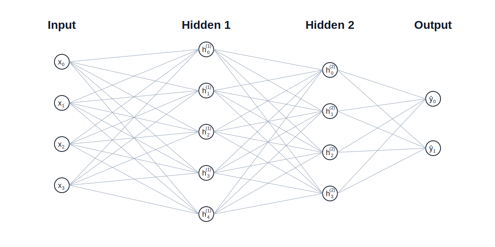

# Syllabus Map

* Study map: [Syllabus Study Map](/posts/syllabus/ioai-study-map/)

---

# Overview

* **Multi-layer perceptrons (MLPs)** are fully connected neural networks that map input features to outputs through stacked linear layers and non-linear activations.
* They learn **non-linear decision boundaries**, making them a strong baseline for tabular data and small to mid‑sized feature sets.
* MLPs are simple, fast to train, and easy to scale, but they **do not model spatial or sequential structure** well.
* Key design levers are **depth**, **width**, **activation functions**, and **regularisation**.

---

# Core idea

* An MLP composes multiple **affine transformations** with **non-linear activations** to approximate complex functions.
* It transforms an input vector $ x $ into a prediction $ \hat{y} $ through layers:  
  $ x \rightarrow h_1 \rightarrow h_2 \rightarrow \cdots \rightarrow \hat{y} $.
* **Benefits**:
  * Universal function approximator in theory (with sufficient width).
  * Strong baseline for **tabular** classification and regression.
  * Straightforward to implement, debug, and deploy.
* **Drawbacks**:
  * Poor inductive bias for images, text, and sequences.
  * Can overfit without careful regularisation.
  * Dense layers scale poorly with very high‑dimensional inputs.

---

# How it works

## Step 1: Define the input and output
* Input $ x \in \mathbb{R}^d $ (feature vector).
* Output $ \hat{y} $ is either:
  * **Regression**: real‑valued vector, or
  * **Classification**: class scores (logits).

## Step 2: Compute the hidden layers
* Each layer applies:  
  $ z^{(l)} = W^{(l)} h^{(l-1)} + b^{(l)} $  
  $ h^{(l)} = \phi(z^{(l)}) $
* At neuron level:
  $ h^{(l)}_i = \phi\left(\sum_j W^{(l)}_{ij} h^{(l-1)}_j + b^{(l)}_i\right) $
* $ \phi $ is a non‑linear activation (e.g., ReLU, tanh, GELU).
* Weights are **fully connected**, so every input connects to every neuron.

## Step 3: Produce the output
* Final layer output:
  * **Regression**: $ \hat{y} = W^{(L)} h^{(L-1)} + b^{(L)} $
  * **Classification**: logits $ \hat{y} $ then softmax:
    $$
    p(y=i \mid x)=\frac{e^{\hat{y}_i}}{\sum_j e^{\hat{y}_j}}
    $$

## Step 4: Compute the loss
* Choose a loss function:
  * **MSE** for regression: $ \mathcal{L}=\frac{1}{n}\sum (y-\hat{y})^2 $
  * **Cross‑entropy** for classification:  
    $ \mathcal{L}=-\sum_i y_i \log p_i $
* The loss measures prediction error across the batch.

## Step 5: Backpropagate gradients
* Use the chain rule to compute gradients:
  $ \frac{\partial \mathcal{L}}{\partial W^{(l)}} $ and $ \frac{\partial \mathcal{L}}{\partial b^{(l)}} $.
* Gradients flow **backwards** from output to input.
* Optimisers (SGD, Adam) update parameters to reduce loss.

## Step 6: Iterate with batches and epochs
* Training proceeds over **mini‑batches** for stable gradient estimates.
* Multiple **epochs** are used to fit the dataset.
* Monitor validation loss to detect **overfitting**.

---

# Practical usage

## Pros and cons
* **Pros**
  * Simple and flexible baseline for many structured problems.
  * Efficient on CPUs and small GPUs.
  * Works well with engineered features.
* **Cons**
  * Not data‑efficient for images or sequences.
  * Can be sensitive to feature scaling.
  * Dense layers can be memory‑heavy at scale.

## Implications and usage
* Use MLPs for **tabular classification/regression**, embeddings, and small‑scale tasks.
* Pair with **normalisation** and **regularisation** for stability.
* For images or text, consider CNNs or transformers unless the input is already vectorised.
