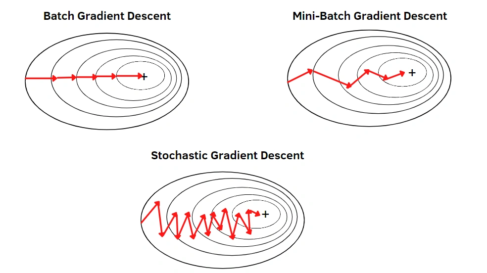

# Syllabus Map

* Study map: [Syllabus Study Map](/posts/syllabus/ioai-study-map/)

---
# Overview

* This note connects perceptron basics to modern training workflows in neural networks.
* Focus areas: gradient descent, backpropagation, activation functions, and loss functions.

---

# Neural Networks & Perceptron Basics

## Core Idea

* Compute a weighted sum of inputs plus a bias.
$$
z = w \cdot x + b
$$
* Apply an activation or decision rule to map $z$ to an output.
$$
\hat{y} = f(z)
$$
* The perceptron is a linear classifier, so it learns a hyperplane.

## Key Components

* Inputs: numeric features (often standardised).
* Weights: learned coefficients that control feature influence.
* Bias: shifts the decision boundary.
* Output: class label (perceptron) or activation value (network).

## Decision Boundary Intuition

* A single perceptron can only separate linearly separable data.
* Nonlinear problems require multiple layers or feature engineering.

## Practical Notes

### Foundations
* Forms the intuition for multilayer networks.
* Introduces learned weights, bias terms, and linear separability.
* The perceptron learning rule updates weights on mistakes, while modern networks use gradient-based updates.

---

# Gradient Descent

## Core Idea

* Iteratively update parameters to reduce the loss.
* Learning rate controls the step size.

## Practical Notes

### Optimization Dynamics
* Batch size affects stability and noise.
* Momentum or adaptive methods can speed up convergence.

### Update Rule
* In general, the update rule is:

$$
w_{t+1} = w_t - \eta \nabla_w L(w_t)
$$

## Types of Gradient Descent

### Full-Batch Gradient Descent

* Uses the entire dataset to compute each gradient step.
* Stable convergence but high per-step cost on large datasets.

### Stochastic Gradient Descent (SGD)

* Uses a single example per update.
* Noisy updates can help explore the loss surface.

### Mini-Batch Gradient Descent

* Uses small batches (e.g., 32 to 512) per update.
* Common default due to efficient hardware utilisation and smoother gradients.

## Linear Regression Form

### Model
$$
\hat{y} = Xw + b,\quad X \in \mathbb{R}^{n \times d},\ w \in \mathbb{R}^{d}
$$
### MSE loss
$$
L(w, b) = \frac{1}{n}\|Xw + b\mathbf{1} - y\|^2
$$
### Gradients
$$
\nabla_w L = \frac{2}{n} X^\top (Xw + b\mathbf{1} - y),\quad
\nabla_b L = \frac{2}{n} \mathbf{1}^\top (Xw + b\mathbf{1} - y)
$$
### Updates
$$
w_{t+1} = w_t - \eta \nabla_w L \\ b_{t+1} = b_t - \eta \nabla_b L
$$

---

# Backpropagation

## Core Idea

* Uses the chain rule to compute gradients layer by layer.
* Propagates Error backward from the output to earlier layers.

## Practical Notes

### Backpropagation
* Requires differentiable activation functions.
* Makes training deep networks computationally feasible.
* Cache intermediate activations to reuse during gradient computation.
* Gradients flow from loss to output layer, then to hidden layers, then to inputs.

## Example Neural Network

* Consider a 2-2-1 network for binary prediction:
  * Input $x \in \mathbb{R}^2$
  * Hidden layer $h = \sigma(W_1 x + b_1)$ with $W_1 \in \mathbb{R}^{2 \times 2}$
  * Output $\hat{y} = \sigma(W_2 h + b_2)$ with $W_2 \in \mathbb{R}^{1 \times 2}$
* Use binary cross entropy: $L = -\big(y \log \hat{y} + (1-y)\log(1-\hat{y})\big)$

## Backprop Flow (Key Gradients)

* Output layer Error: $\delta_2 = \hat{y} - y$
* Output weights: $\nabla_{W_2} L = \delta_2 h^\top$, bias: $\nabla_{b_2} L = \delta_2$
* Hidden Error: $\delta_1 = (W_2^\top \delta_2) \odot \sigma'(W_1 x + b_1)$
* Hidden weights: $\nabla_{W_1} L = \delta_1 x^\top$, bias: $\nabla_{b_1} L = \delta_1$

---

# Activation Functions

## Core Idea

* Introduce nonlinearity so networks can model complex patterns.
* Shape gradient flow during training.

## Practical Notes

### Activation Choice
* Choice affects convergence speed and stability.
* Modern defaults often start with ReLU-like activations.

## ReLU

* $\max(0, x)$ keeps positive signals.
* Risk of dead neurons if inputs are consistently negative.

## Sigmoid

* Outputs in $[0, 1]$, useful for probabilities.
* Saturation can slow learning due to small gradients.

## Tanh

* Outputs in $[-1, 1]$, centred around zero.
* Often trains faster than sigmoid in hidden layers.

---

# Loss Functions

## Core Idea

* A loss measures prediction Error and drives gradient updates.
* Pick losses to match the output type and task.

## Practical Notes

### Loss Selection
* Scaling and label encoding affect loss behaviour.
* Monitor both loss curves and task metrics during training.

## Regression

* Mean Squared Error (MSE) penalises large errors strongly.
* Mean Absolute Error (MAE) is more robust to outliers.

## Classification

* Cross Entropy for multi-class problems.
* Binary Cross Entropy for two-class problems.

