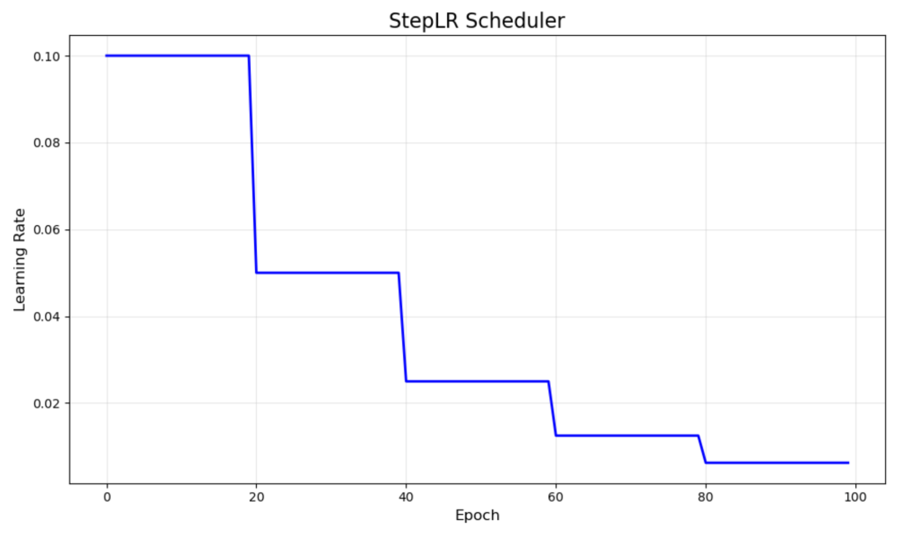
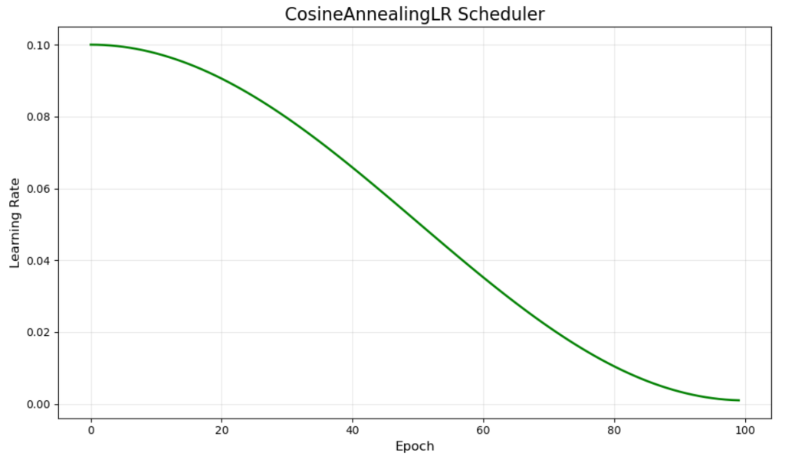
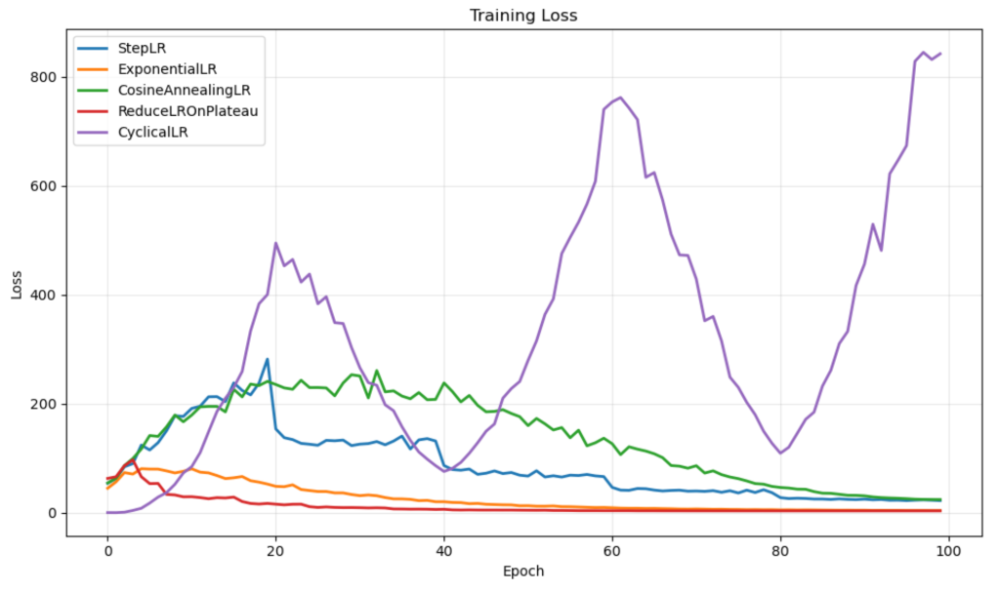

# Syllabus Map

* Study map: [Syllabus Study Map](/posts/syllabus/ioai-study-map/)

---

# Overview

* This note covers **optimisers**, **convergence behaviour**, and **regularisation** for neural networks.
* Each section focuses on **key ideas**, **equations**, and **practical choices** that affect training stability and generalisation.

---

# Optimisers

## Core idea
* Optimisers update parameters $ \theta $ to minimise a **loss** $ \mathcal{L}(\theta) $.
* The basic update is:  
  $$ \theta_{t+1} = \theta_t - \eta \nabla_\theta \mathcal{L}(\theta_t) $$
* Different optimisers trade off **speed**, **stability**, and **generalisation**.

## Gradient descent
* Uses the **full dataset** to compute the gradient.
* Stable but **slow** for large datasets.
* Update rule:
$$
\theta_{t+1} = \theta_t - \eta \nabla \mathcal{L}(\theta_t)
$$

## SGD
* Uses **mini‑batches** to approximate the gradient.
* Faster updates, introduces useful **noise** for generalisation.
* Update rule:
$$
\theta_{t+1} = \theta_t - \eta g_t
$$

## Momentum
* Accumulates a **velocity** to smooth updates:
  * The velocity acts like an **exponential moving average** of past gradients.
  * It builds **inertia** in consistent directions and filters out noisy updates.
  * A typical momentum coefficient is $ \mu \in [0.9, 0.99] $.
* Helps traverse **flat regions** and **damp oscillations**.
* Update rule:
$$
v_t = \mu v_{t-1} + g_t
$$
$$
\theta_{t+1} = \theta_t - \eta v_t
$$

## Adagrad
* Adapts the **learning rate per parameter** based on past gradients.
* Good for **sparse features**, but can decay too aggressively.
* Difference between $ r_t $ and $ \eta $:
  * $ r_t $ is the **accumulated sum of squared gradients** for each parameter.
  * It grows over time, so parameters with large historical gradients get **smaller effective steps**.
  * $ \eta $ is the **global base learning rate**, while $ r_t $ is the **per‑parameter history** that scales it.
  * Effective step size is $ \eta \over (\sqrt{r_t} + \epsilon) $, which shrinks as $ r_t $ increases.
* Update rule:
$$
r_t = r_{t-1} + g_t^2
$$
$$
\theta_{t+1} = \theta_t - \eta \frac{g_t}{\sqrt{r_t} + \epsilon}
$$

## RMSprop
* Fixes Adagrad’s aggressive decay with an **exponential moving average**.
* Works well for **non‑stationary objectives**.
* Update rule:
$$
r_t = \rho r_{t-1} + (1-\rho) g_t^2
$$
$$
\theta_{t+1} = \theta_t - \eta \frac{g_t}{\sqrt{r_t} + \epsilon}
$$

## Adam
* Combines **momentum** and **RMSprop** ideas (first and second moments).
* Strong **default** for many tasks.
* Update rule:
$$
m_t = \beta_1 m_{t-1} + (1-\beta_1) g_t
$$
$$
v_t = \beta_2 v_{t-1} + (1-\beta_2) g_t^2
$$
$$
\theta_{t+1} = \theta_t - \eta \frac{\hat{m}_t}{\sqrt{\hat{v}}_t + \epsilon}
$$

## AdamW
* Decouples **weight decay** from the gradient update.
* More reliable regularisation than L2 inside Adam’s adaptive update.
* Common default for transformer‑style models.
* Update rule:
$$
\theta_{t+1} = \theta_t - \eta \frac{\hat{m}_t}{\sqrt{\hat{v}}_t + \epsilon} - \eta \lambda \theta_t
$$

### Decoupled weight decay vs L2 in Adam

**Adam + L2 (coupled)**
$$
g'_t = g_t + \lambda \theta_t
$$
$$
m_t = \beta_1 m_{t-1} + (1-\beta_1) g'_t
$$
$$
v_t = \beta_2 v_{t-1} + (1-\beta_2) (g'_t)^2
$$
$$
\theta_{t+1} = \theta_t - \eta \frac{\hat{m}_t}{\sqrt{\hat{v}}_t + \epsilon}
$$

**AdamW (decoupled)**
$$
m_t = \beta_1 m_{t-1} + (1-\beta_1) g_t
$$
$$
v_t = \beta_2 v_{t-1} + (1-\beta_2) g_t^2
$$
$$
\theta_{t+1} = \theta_t - \eta \frac{\hat{m}_t}{\sqrt{\hat{v}}_t + \epsilon} - \eta \lambda \theta_t
$$

* Think of **weight decay** as “gently shrinking” weights every step.
* In classic Adam + L2, the shrink happens **inside** the adaptive update, so each weight gets **shrunk by a different amount**.
* In AdamW, the shrink is **separate and uniform**, so every weight gets the **same decay strength**.
* This makes AdamW more predictable and usually easier to tune.

## Practical Notes

### Start with a strong optimizer baseline

* Adam is usually a fast default for early experimentation.

### Compare with SGD + momentum for final quality

* On many vision tasks, SGD + momentum remains competitive for generalization.

### Tune learning rate before optimizer switching

* Learning-rate choice usually has larger impact than changing optimizer family.

---

# Convergence

## What convergence means
* Training loss **stabilises** and gradients approach zero:  
  $ \|\nabla \mathcal{L}(\theta)\| \rightarrow 0 $
* Validation loss should **improve**, then **plateau** without diverging.

## Learning rate behaviour
* Too high $ \eta $ causes **divergence** or **oscillation**.
* Too low $ \eta $ causes **slow training** and poor minima.
* Schedules help balance exploration and refinement:
  * **Step decay**: drop $ \eta $ at fixed epochs.
  * **Cosine decay**: smooth reduction over time.
  * **Warmup**: start small, then ramp to target $ \eta $.

## Learning rate schedulers
* The learning rate is a **hyperparameter** that strongly affects convergence.

### Step-based schedulers
* Drops learning rate by a fixed amount every $ k $ epochs.


### Exponential schedulers
* Smooth exponential decay of learning rate.


### Cosine annealing schedulers
* Smoothly decreases learning rate following a cosine curve.


### Cyclical schedulers
* Learning rate oscillates between a set of values.
* wtf who designed this


### Performance-based schedulers
* Adjust learning rate based on validation performance.
* e.g. ReduceLROnPlateau.
* Adjust LR only when improvement stagnates.
* Adaptive to validation metrics.


### Loss performance on MNIST data


### Warmup + decay (typical recipe)
* To stabilise early training, models usually include a **warmup** phase, starting with a small learning rate and gradually increasing it.
* Once warmup reaches the peak value, gradually decrease the learning rate using the schedulers above.

## Diagnostics
* Plot **loss curves** for train and validation.
* Watch for **overfitting** (train loss down, val loss up).
* Monitour gradients to detect **exploding/vanishing** behaviour.

---

# Regularisation

## Core idea
* Regularisation adds **constraints** to reduce overfitting.
* It balances **bias/variance** by discouraging overly complex solutions.

## Dropout
* Randomly **zeroes activations** during training:  
  $ h' = m \odot h, \quad m \sim \text{Bernoulli}(p) $
* Forces the network to learn **redundant representations**.
* Use typical rates: 0.1–0.5 depending on model size.

### PyTorch example
```py
import torch.nn as nn

model = nn.Sequential(
    nn.Linear(256, 128),
    nn.ReLU(),
    nn.Dropout(p=0.3),
    nn.Linear(128, 10),
)
```

## Early stopping
* Stop training when validation loss **stops improving**.
* Saves computation and **prevents overfitting**.
* Use a **patience** window (e.g., 5–10 epochs).

### PyTorch example
```py
best_val = float("inf")
patience = 5
wait = 0

for epoch in range(100):
    # train ...
    val_loss = validate(model, val_loader)

    if val_loss < best_val:
        best_val = val_loss
        wait = 0
        best_state = {k: v.cpu() for k, v in model.state_dict().items()}
    else:
        wait += 1
        if wait >= patience:
            model.load_state_dict(best_state)
            break
```

## Weight decay
* Adds **L2 penalty** to the loss:  
  $ \mathcal{L}' = \mathcal{L} + \lambda \|\theta\|^2 $
* Shrinks weights and improves **generalisation**.
* Commonly paired with SGD or AdamW.

## Label smoothing
* Replaces hard one-hot targets with slightly softened targets.
* Reduces overconfident predictions and can improve generalisation.
* For $K$ classes and smoothing factor $\alpha$:
  * True class target: $1-\alpha$
  * Each non-true class target: $\frac{\alpha}{K-1}$
* Example for $K=5$, $\alpha=0.1$:
  * True class target is $0.9$, others are $0.025$ each.
* Typical $\alpha$ values are small (for example `0.05` to `0.2`).
* Too much smoothing can hurt class separation and calibration for some tasks.

## Practical usage
* Combine **data augmentation** with regularisation for best results.
* Use **dropout** more in fully connected layers than in convolutional layers.
* Prefer **AdamW** when using weight decay with Adam-style optimisers.


