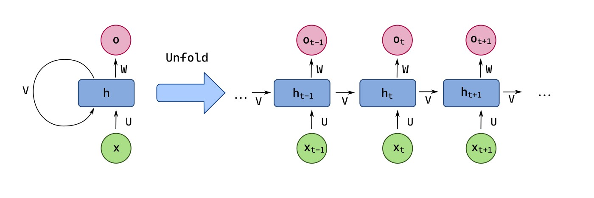
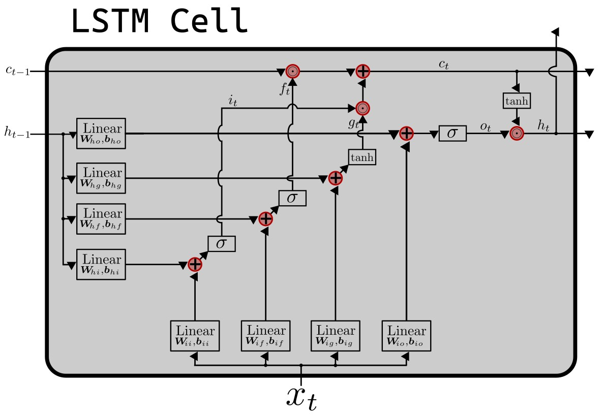

# RNNs, LSTMs, and GRUs

# Syllabus Map

* Study map: [Syllabus Study Map](/posts/syllabus/ioai-study-map/)

---

## Outline
- Sequence modelling is a machine learning technique for analysing and predicting patterns in ordered data
- This means the sequence (like words in a sentence or stock prices over time) matters
- These sequential models typically consist of:
  - RNNs
  - LSTMs
  - GRUs

## RNNs

### Core idea (high level)
- **RNNs** process sequences step by step, carrying a **hidden state** forward
- Each **timestep** reuses the same **weights** to incorporate past context
- This simple memory can struggle with **long-term dependencies**

### Notation
- Input at time $ t $: $ x_t $
- **Hidden state** (memory) at time $ t $: $ a_t $
- Output at time $ t $: $ y_t $
- Previous hidden state: $ a_{t-1} $

### How it works (specific)
- RNNs utilise **recurrent connections**, where the output of a neuron at one time step is fed back as input to the network at the next time step
- For a RNN, there are a few things we need to keep track of:
  - The current timestep $ t $ 
  - The input at the current timestep $ x_t $
  - The output at the current timestep $ y_t $
  - The hidden states at the previous timestep  $ a_{t-1} $ and current timestep $ a_t $
- Broadly speaking, the RNN can be summarised as a function
$$
f_\theta: (x_t, a_{t-1}) \mapsto (y_t, a_t)
$$

#### 1. Set an initial hidden state $ a_0 $
- The initial hidden state $ a_0 $ needs to be passed into the first timestep $ t=1 $
- Usually, this is done by setting $ a_0 = 0 $
- Some implementations learn a **trainable** $ a_0 $ instead of using zeros
- The choice of $ a_0 $ can affect early outputs for short sequences

#### 2. Calculate the hidden state $ a_t $
- Using the hidden state of the previous timestep $ t-1 $, take an input $ x_t $ to calculate $ a_t $
- The nonlinearity $ \phi $ is commonly $ \tanh $ or $ \mathrm{ReLU} $
- **Weights are shared** across all timesteps, which keeps parameter count fixed
$$
a_t = \phi(W_a a_{t-1} + W_x x_t + b_a)
$$

#### 3. Calculate the output for this timestep $ y_t $
- Using the hidden state $ a_t $, calculate the output $ y_t $ 
- The output can be used at every timestep or only at the **final step**, depending on the task
- A softmax layer is common for classification outputs
$$
y_t = W_y a_t + b_y
$$

#### 4. Pass the current hidden state $ a_t $ to the next timestep $ t+1 $
- The current hidden state $ a_t $ is passed along to the next timestep as a form of input
- Steps 1 to 4 are repeated for all of the sequential data
- **Backpropagation through time (BPTT)** is used to train the parameters
- **Gradients** can explode or vanish as sequence length grows

### Practical usage
- Short-sequence tasks where long-term memory is not critical (e.g., character-level text, simple sequence classification)
- Baseline time-series forecasting or anomaly detection with limited context
- Lightweight sequence labelling when model size and speed matter

## LSTMs

### Core idea (high level)
- A standard RNN has one stream of memory that gets overwritten as new inputs arrive
- An **LSTM** adds a separate, protected **memory channel** and explicit control mechanisms that decide:
  - what to keep,
  - what to discard, 
  - what to output at each time step.
- This gives superiour control over the memory provided to the model at every timestep, splitting the memory into long-term memory and short-term memory

### Notation (gates and memory)
- The **gates** are element-wise values in $ [0, 1] $ that control how much information is retained, added, or exposed:
  - **Forget gate**: $ f_t $ (how much of $ C_{t-1} $ to keep)
  - **Input gate**: $ i_t $ (how much new information to write)
  - **Output gate**: $ o_t $ (how much of the cell state to expose as output)
- **Cell state** (long-term memory): $ C_t $
- **Hidden state** (short-term memory/output): $ h_t $
- Input at time $ t $: $ x_t $

### How it works (specific)
#### 1. Set the initial states $ h_0 $ and $ C_0 $
- Initialise the hidden state and cell state (often zeros).
- Some implementations learn $ h_0 $ and $ C_0 $ as **trainable parameters**
- These initial states seed the memory for the first timestep

#### 2. Compute the forget gate $ f_t $
- The forget gate decides how much of $ C_{t-1} $ is retained
- Values close to 0 drop old information; values close to 1 keep it
$$
f_t = \sigma(W_f [h_{t-1}, x_t] + b_f)
$$

#### 3. Compute the input gate $ i_t $ and candidate memory $ \tilde{C}_t $
- The input gate controls how much new information is written to memory
- The **candidate memory** proposes new content to add
$$
i_t = \sigma(W_i [h_{t-1}, x_t] + b_i)
$$
$$
\tilde{C}_t = \tanh(W_C [h_{t-1}, x_t] + b_C)
$$

#### 4. Update the cell state $ C_t $
- The cell state blends retained memory with new candidate content
- This pathway helps **gradients** flow across long sequences
$$
C_t = f_t \odot C_{t-1} + i_t \odot \tilde{C}_t
$$

#### 5. Compute the output gate $ o_t $
- The output gate decides how much of the cell state is exposed
- It controls the information sent to the next layer or timestep
$$
o_t = \sigma(W_o [h_{t-1}, x_t] + b_o)
$$

#### 6. Compute the hidden state $ h_t $
- The hidden state is the **short-term**, exposed memory
- It is what downstream layers typically consume
$$
h_t = o_t \odot \tanh(C_t)
$$

### Practical usage
- Long-range dependency tasks (e.g., document classification, language modelling, machine translation)
- Speech recognition and synthesis, where temporal context matters over many steps
- Time-series forecasting with seasonal or delayed effects

## GRUs

### Core idea (high level)
- A **GRU** merges the LSTM's cell state and hidden state into a single state $ h_t $
- It uses two gates to control information flow:
  - **Update gate** $ z_t $ decides how much past information to keep
  - **Reset gate** $ r_t $ decides how much past information to forget when proposing new content
- This makes GRUs simpler and often faster than LSTMs while retaining strong performance

### Notation (gates and memory)
- **Update gate**: $ z_t $ (how much of $ h_{t-1} $ to keep)
- **Reset gate**: $ r_t $ (how much of $ h_{t-1} $ to use in candidate)
- **Hidden state** (memory/output): $ h_t $
- **Candidate hidden state**: $ \tilde{h}_t $
- Input at time $ t $: $ x_t $

### How it works (specific)
#### 1. Set the initial hidden state $ h_0 $
- Initialise the hidden state (often zeros).
- Some implementations learn a **trainable** $ h_0 $
- This state acts as the initial memory before any inputs

#### 2. Compute the update gate $ z_t $
- The update gate controls how much of the past is carried forward
- Larger $ z_t $ values preserve $ h_{t-1} $
$$
z_t = \sigma(W_z [h_{t-1}, x_t] + b_z)
$$

#### 3. Compute the reset gate $ r_t $
- The reset gate controls how much past information influences the candidate
- Smaller $ r_t $ values push the model to ignore old context
$$
r_t = \sigma(W_r [h_{t-1}, x_t] + b_r)
$$

#### 4. Compute the candidate hidden state $ \tilde{h}_t $
- The candidate mixes current input with a gated version of past state
- It represents the proposed new content for memory
$$
\tilde{h}_t = \tanh(W_h [r_t \odot h_{t-1}, x_t] + b_h)
$$

#### 5. Update the hidden state $ h_t $
- The final state interpolates between old and candidate states
- This interpolation is simpler than the LSTM cell/hidden split
$$
h_t = (1 - z_t) \odot \tilde{h}_t + z_t \odot h_{t-1}
$$

### Practical usage
- Similar to LSTMs but with fewer parameters, useful for smaller datasets or faster training
- Real-time or edge deployments where model size/latency is constrained
- Robust baselines for many sequence tasks (e.g., sentiment, tagging, forecasting)

