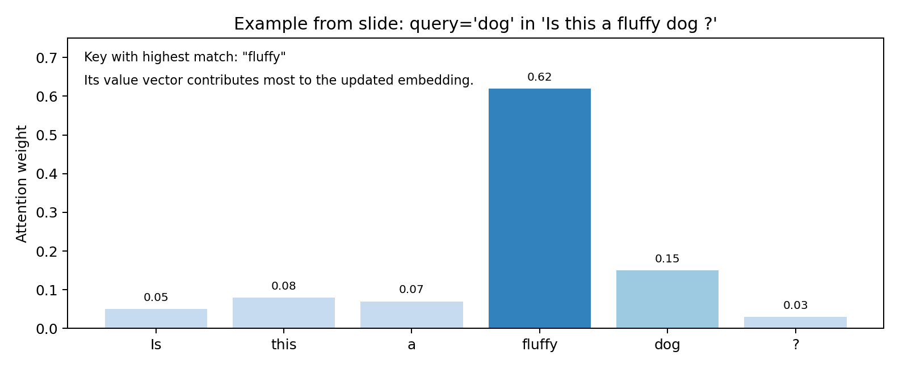

# Syllabus Map

* Study map: [Syllabus Study Map](/posts/syllabus/ioai-study-map/)

---

# Overview

* Attention lets each token directly read relevant tokens, instead of compressing everything into one fixed vector.
* Transformers stack attention and feed-forward blocks for scalable sequence modelling.
* Core advantages over RNNs: parallel training and better long-range dependency handling.

---

# Scaled Dot-Product Attention

## Definition
* Each token is projected into query ($Q$), key ($K$), and value ($V$) vectors.
* Attention weights are similarity scores between queries and keys.

$$
\text{Attention}(Q,K,V)=\text{softmax}\!\left(\frac{QK^\top}{\sqrt{d_k}}\right)V
$$

* $d_k$ is key dimension; scaling by $\sqrt{d_k}$ stabilises logits.
  * Without scaling, dot products $q \cdot k$ tend to grow with $d_k$.
  * Large-magnitude logits make softmax too peaky, which shrinks gradients and makes optimisation unstable.
  * Dividing by $\sqrt{d_k}$ keeps logit scale more consistent across model widths.
* Softmax rows sum to 1, so each token computes a weighted sum of value vectors.

## Intuition

* 3Blue1Brown-style intuition:
  * **Query ($Q$)**: what this token is looking for.
  * **Key ($K$)**: what this token can offer (a potential answer to queries).
  * **Value ($V$)**: the information payload passed forward if the key matches the query.
* Example:
  * Sentence: `Is this a fluffy dog?`
  * For query token `dog`, compare against keys from all tokens.
  * The word `Fluffy` gets a high score, so its value vector contributes strongly to `dog`'s updated representation.
* Each query compares against all keys using dot products.
* Softmax turns scores into weights, then a weighted sum of values builds the context-rich output.

---

# Multi-Head Attention

* Instead of one attention map, use multiple heads to capture different relations.

$$
\text{head}_i=\text{Attention}(QW_i^Q,KW_i^K,VW_i^V)
$$

$$
\text{MHA}(Q,K,V)=\text{Concat}(\text{head}_1,\dots,\text{head}_h)W^O
$$

* $h$ is number of heads.
* Different heads often specialise (syntax, positional patterns, long dependencies).

---

# Transformer Block

* Standard block has:
  * Multi-head attention,
  * Position-wise feed-forward network (FFN),
  * Residual connections and layer normalization.

$$
X' = X + \text{MHA}(\text{LN}(X))
$$

$$
Y = X' + \text{FFN}(\text{LN}(X'))
$$

* FFN is typically two linear layers with nonlinearity (GELU/ReLU).

## How FFN Works

* The same FFN is applied **independently to each token position**.
* Typical form:
$$
\text{FFN}(x)=W_2\,\sigma(W_1x+b_1)+b_2
$$
* First layer expands dimension (for example $d_{\text{model}} \to d_{\text{ff}}$), nonlinearity adds expressive power, second layer projects back.
* Attention mixes information **across tokens**; FFN then transforms features **within each token**.
* A common choice is $d_{\text{ff}} \approx 4d_{\text{model}}$.

---

# Positional Information

* Attention alone is permutation-invariant; position encoding is required.
* Common choices:
  * Learned absolute positional embeddings,
  * Sinusoidal embeddings,
  * Relative/RoPE-style methods in modern LLMs.

---

# Encoder vs Decoder Attention

## Encoder Self-Attention

* Bidirectional: token can attend to all tokens in the sequence.
* Used in BERT-like encoders.

## Decoder Self-Attention (Causal)

* Masked: token at position $t$ can only attend to positions $\le t$.
* Used in GPT-style autoregressive models.

## Cross-Attention

* Decoder queries attend to encoder keys/values.
* Used in seq2seq tasks (translation, summarization).

---

# Complexity and Scaling

* Full self-attention cost is quadratic in sequence length:

$$
\mathcal{O}(n^2 d)
$$

* $n$ is sequence length and $d$ is hidden size.
* Long-context variants (sparse/windowed attention) reduce memory/compute.

---

# Practical Notes

## Attention heads and depth matter more than single-layer width for many tasks.

* Attention heads and depth matter more than single-layer width for many tasks.
## Longer context improves tasks with long dependencies but raises cost.

* Longer context improves tasks with long dependencies but raises cost.
## Prompt/instruction format strongly affects decoder-model behavior at inference.

* Prompt/instruction format strongly affects decoder-model behavior at inference.

